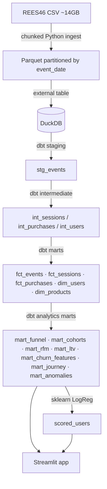

# Cohort Compass Implementation Plan

> **For agentic workers:** REQUIRED SUB-SKILL: Use superpowers:subagent-driven-development (recommended) or superpowers:executing-plans to implement this plan task-by-task. Steps use checkbox (`- [ ]`) syntax for tracking.

**Goal:** Build an end-to-end e-commerce retention & LTV analytics portfolio platform on 285M REES46 events with SQL-first architecture (dbt + DuckDB) and an interactive Streamlit explorer that exposes every chart's underlying SQL.

**Architecture:** Chunked Python ingest (CSV → Parquet partitioned by event_date) → DuckDB analytical store → dbt-duckdb (staging → intermediate → marts) → Streamlit multipage app with "Show SQL" toggle + sklearn churn classifier feeding a what-if simulator. Deployed via Streamlit Community Cloud (sampled data) + GitHub Pages (dbt docs).

**Tech Stack:** Python 3.12 · uv · DuckDB 1.x · dbt-core 1.8 + dbt-duckdb · scikit-learn · Streamlit · Plotly · Kaggle API · GitHub Actions · Loom

**Source spec:** `C:\Users\djinc\.claude\plans\quizzical-bouncing-beaver.md`

---

## File Structure

```
cohort-compass/
├── README.md                          # Portfolio-facing readme
├── pyproject.toml                     # uv project + deps
├── uv.lock
├── Makefile                           # make data | dbt | ml | app | docs
├── .env.example                       # Kaggle creds template
├── .gitignore                         # excludes data/, .duckdb, .env
├── .streamlit/config.toml             # theme + server config
├── docs/
│   ├── architecture.md                # Mermaid diagram + decisions
│   ├── sql-highlights.md              # 12 SQL patterns explained
│   └── screenshots/                   # 6+ PNGs for README
├── data/                              # gitignored
│   ├── raw/                           # downloaded CSVs
│   └── parquet/                       # partitioned by event_date
├── warehouse/
│   └── cohort_compass.duckdb          # gitignored single-file DB
├── scripts/
│   ├── download_data.py               # Kaggle API → data/raw/
│   ├── ingest.py                      # CSV → Parquet partitions
│   └── sample_for_deploy.py           # 10% user sample → small.duckdb
├── dbt/
│   ├── dbt_project.yml
│   ├── profiles.yml                   # gitignored copy via env vars
│   ├── packages.yml                   # dbt_utils
│   ├── models/
│   │   ├── sources.yml                # raw Parquet external tables
│   │   ├── staging/
│   │   │   ├── stg_events.sql
│   │   │   └── stg_events.yml         # tests + descriptions
│   │   ├── intermediate/
│   │   │   ├── int_sessions.sql
│   │   │   ├── int_purchases.sql
│   │   │   ├── int_users.sql
│   │   │   └── intermediate.yml
│   │   └── marts/
│   │       ├── fct_events.sql
│   │       ├── fct_sessions.sql
│   │       ├── fct_purchases.sql
│   │       ├── dim_users.sql
│   │       ├── dim_products.sql
│   │       ├── mart_funnel.sql
│   │       ├── mart_cohorts.sql
│   │       ├── mart_rfm.sql
│   │       ├── mart_ltv.sql
│   │       ├── mart_churn_features.sql
│   │       ├── mart_journey.sql
│   │       ├── mart_anomalies.sql
│   │       └── marts.yml
│   ├── macros/
│   │   ├── generate_cohort_periods.sql
│   │   └── ntile_safe.sql
│   ├── tests/                         # singular tests
│   │   ├── funnel_monotonic.sql
│   │   └── rfm_segments_complete.sql
│   └── seeds/
│       └── category_labels.csv        # optional category→EN map
├── ml/
│   ├── __init__.py
│   ├── features.py                    # pure functions: feature prep
│   ├── train_churn.py                 # entry point: train + score
│   ├── evaluate.py                    # AUC / confusion / roc curve
│   └── tests/
│       ├── test_features.py
│       └── test_evaluate.py
├── app/
│   ├── Home.py                        # Overview page (Streamlit entry)
│   ├── lib/
│   │   ├── __init__.py
│   │   ├── db.py                      # DuckDB connection helper
│   │   ├── filters.py                 # sidebar filter widget
│   │   ├── sql_toggle.py              # "Show SQL" component
│   │   ├── queries.py                 # all SQL strings centralized
│   │   └── format.py                  # number/currency formatting
│   ├── pages/
│   │   ├── 1_Funnel.py
│   │   ├── 2_Cohorts.py
│   │   ├── 3_RFM.py
│   │   ├── 4_Churn_Lab.py
│   │   ├── 5_Customer_Journey.py
│   │   ├── 6_Auto_Insights.py
│   │   └── 7_Data_Model.py
│   └── tests/
│       ├── test_queries.py
│       ├── test_filters.py
│       └── test_format.py
└── .github/workflows/
    ├── dbt-test.yml                   # dbt parse + test on PR
    └── deploy-docs.yml                # dbt docs → GitHub Pages
```

**Boundaries:**
- `scripts/` — one-shot operational scripts (idempotent re-runs)
- `dbt/` — declarative SQL transformations only, no business logic outside SQL
- `ml/` — pure Python, reads from DuckDB, writes scored_users back
- `app/lib/` — reusable utilities, no Streamlit page logic
- `app/pages/` — page-level UI, imports from `lib`
- All SQL strings live in `app/lib/queries.py` (single source for "Show SQL" toggle)

---

## Conventions

- **Python:** type hints everywhere, ruff format, ruff check
- **SQL:** lowercase keywords in dbt models is fine, but for Show-SQL display we keep model SQL readable
- **Commits:** Conventional commits (`feat:`, `test:`, `chore:`, `docs:`, `fix:`)
- **Test runners:** `pytest` for Python, `dbt test` for SQL
- **Branching:** trunk-based, commit per task

---

## Phase 0 — Repo & Tooling Setup

### Task 0.1: Initialize repo and uv project

**Files:**
- Create: `pyproject.toml`
- Create: `.gitignore`
- Create: `.env.example`
- Create: `README.md` (stub)

- [ ] **Step 1: Create directory and initialize git**

```bash
mkdir cohort-compass && cd cohort-compass
git init
git branch -M main
```

- [ ] **Step 2: Initialize uv project**

```bash
uv init --no-readme --no-pin-python
```

- [ ] **Step 3: Write `pyproject.toml`**

```toml
[project]
name = "cohort-compass"
version = "0.1.0"
description = "End-to-end retention & LTV analytics platform on 285M e-commerce events."
requires-python = ">=3.12"
dependencies = [
    "duckdb>=1.1.0",
    "dbt-core>=1.8.0",
    "dbt-duckdb>=1.8.0",
    "pandas>=2.2.0",
    "pyarrow>=17.0.0",
    "streamlit>=1.38.0",
    "plotly>=5.24.0",
    "scikit-learn>=1.5.0",
    "kaggle>=1.6.17",
    "python-dotenv>=1.0.0",
]

[dependency-groups]
dev = [
    "pytest>=8.3.0",
    "pytest-cov>=5.0.0",
    "ruff>=0.6.0",
]

[tool.ruff]
line-length = 100
target-version = "py312"

[tool.ruff.lint]
select = ["E", "F", "W", "I", "B", "UP"]

[tool.pytest.ini_options]
testpaths = ["ml/tests", "app/tests", "scripts/tests"]
addopts = "-v --tb=short"
```

- [ ] **Step 4: Write `.gitignore`**

```gitignore
# Python
__pycache__/
*.py[cod]
.venv/
.pytest_cache/
.coverage
.ruff_cache/

# Data + artifacts
data/
warehouse/
*.duckdb
*.duckdb.wal

# Secrets
.env
dbt/profiles.yml
~/.kaggle/

# IDE
.vscode/
.idea/
*.swp

# OS
.DS_Store
Thumbs.db

# Streamlit
.streamlit/secrets.toml

# Project artifacts
target/
dbt_packages/
logs/
```

- [ ] **Step 5: Write `.env.example`**

```
# Copy to .env and fill in
KAGGLE_USERNAME=your_username
KAGGLE_KEY=your_api_key
DUCKDB_PATH=warehouse/cohort_compass.duckdb
```

- [ ] **Step 6: Sync dependencies**

```bash
uv sync
```

Expected: `.venv/` created, `uv.lock` written.

- [ ] **Step 7: Commit**

```bash
git add pyproject.toml uv.lock .gitignore .env.example
git commit -m "chore: initialize uv project with deps"
```

---

### Task 0.2: Makefile + directory scaffolding

**Files:**
- Create: `Makefile`
- Create directory tree (placeholders)

- [ ] **Step 1: Create directory skeleton**

```bash
mkdir -p data/raw data/parquet warehouse
mkdir -p scripts dbt/models/staging dbt/models/intermediate dbt/models/marts
mkdir -p dbt/macros dbt/tests dbt/seeds
mkdir -p ml/tests app/lib app/pages app/tests
mkdir -p docs/screenshots .github/workflows .streamlit
touch data/raw/.gitkeep data/parquet/.gitkeep warehouse/.gitkeep
```

- [ ] **Step 2: Write `Makefile`**

```makefile
.PHONY: help install data ingest dbt-deps dbt-build dbt-test dbt-docs ml app sample-deploy lint test clean

help:
	@echo "make install       — uv sync deps"
	@echo "make data          — download REES46 from Kaggle"
	@echo "make ingest        — CSV → Parquet partitions → DuckDB"
	@echo "make dbt-deps      — install dbt packages"
	@echo "make dbt-build     — dbt seed + run + test"
	@echo "make dbt-test      — dbt test only"
	@echo "make dbt-docs      — generate dbt docs HTML"
	@echo "make ml            — train churn model + score users"
	@echo "make app           — run Streamlit locally"
	@echo "make sample-deploy — build sampled DB for cloud deploy"
	@echo "make lint          — ruff format + check"
	@echo "make test          — pytest"
	@echo "make clean         — remove warehouse + parquet"

install:
	uv sync

data:
	uv run python scripts/download_data.py

ingest:
	uv run python scripts/ingest.py

dbt-deps:
	cd dbt && uv run dbt deps

dbt-build: dbt-deps
	cd dbt && uv run dbt build

dbt-test:
	cd dbt && uv run dbt test

dbt-docs:
	cd dbt && uv run dbt docs generate && uv run dbt docs serve --no-browser --port 8081

ml:
	uv run python -m ml.train_churn

app:
	uv run streamlit run app/Home.py

sample-deploy:
	uv run python scripts/sample_for_deploy.py

lint:
	uv run ruff format .
	uv run ruff check . --fix

test:
	uv run pytest

clean:
	rm -rf warehouse/*.duckdb data/parquet/*
```

- [ ] **Step 3: Write `.streamlit/config.toml`**

```toml
[theme]
primaryColor = "#FF6B35"
backgroundColor = "#FFFFFF"
secondaryBackgroundColor = "#F4F4F4"
textColor = "#262730"
font = "sans serif"

[server]
maxUploadSize = 50
enableXsrfProtection = true

[browser]
gatherUsageStats = false
```

- [ ] **Step 4: Verify `make help` runs**

```bash
make help
```

Expected: prints target list.

- [ ] **Step 5: Commit**

```bash
git add Makefile .streamlit/ data/.gitkeep data/raw/.gitkeep data/parquet/.gitkeep warehouse/.gitkeep
git commit -m "chore: add Makefile and directory scaffolding"
```

---

### Task 0.3: dbt project init

**Files:**
- Create: `dbt/dbt_project.yml`
- Create: `dbt/profiles.yml` (template; actual at `~/.dbt/profiles.yml` or env)
- Create: `dbt/packages.yml`

- [ ] **Step 1: Write `dbt/dbt_project.yml`**

```yaml
name: 'cohort_compass'
version: '0.1.0'
config-version: 2

profile: 'cohort_compass'

model-paths: ["models"]
macro-paths: ["macros"]
seed-paths: ["seeds"]
test-paths: ["tests"]
snapshot-paths: ["snapshots"]
analysis-paths: ["analyses"]

clean-targets:
  - "target"
  - "dbt_packages"
  - "logs"

models:
  cohort_compass:
    staging:
      +materialized: view
    intermediate:
      +materialized: ephemeral
    marts:
      +materialized: table

vars:
  start_date: '2019-10-01'
  end_date: '2020-04-30'
  session_gap_minutes: 30
```

- [ ] **Step 2: Write `dbt/profiles.yml`**

```yaml
cohort_compass:
  target: dev
  outputs:
    dev:
      type: duckdb
      path: "{{ env_var('DUCKDB_PATH', '../warehouse/cohort_compass.duckdb') }}"
      threads: 4
      extensions:
        - httpfs
        - parquet
```

- [ ] **Step 3: Write `dbt/packages.yml`**

```yaml
packages:
  - package: dbt-labs/dbt_utils
    version: 1.3.0
```

- [ ] **Step 4: Install dbt packages**

```bash
cd dbt && uv run dbt deps
```

Expected: `dbt_packages/dbt_utils/` exists.

- [ ] **Step 5: Verify dbt parses**

```bash
cd dbt && DUCKDB_PATH=../warehouse/cohort_compass.duckdb uv run dbt parse
```

Expected: `Parsed N models successfully` (0 models so far, no errors).

- [ ] **Step 6: Update `.gitignore` to exclude `dbt_packages`**

Already covered by existing `dbt_packages/` rule.

- [ ] **Step 7: Commit**

```bash
git add dbt/
git commit -m "chore: initialize dbt project with duckdb adapter"
```

---

## Phase 1 — Data Ingestion

### Task 1.1: Kaggle download script

**Files:**
- Create: `scripts/__init__.py`
- Create: `scripts/download_data.py`
- Create: `scripts/tests/__init__.py`
- Create: `scripts/tests/test_download_paths.py`

- [ ] **Step 1: Write failing test**

`scripts/tests/test_download_paths.py`:

```python
from pathlib import Path
from scripts.download_data import expected_files, RAW_DIR


def test_expected_files_lists_seven_months():
    files = expected_files()
    assert len(files) == 7
    assert "2019-Oct.csv" in files
    assert "2020-Apr.csv" in files


def test_raw_dir_is_data_raw():
    assert RAW_DIR == Path("data/raw")
```

- [ ] **Step 2: Run test, expect failure**

```bash
uv run pytest scripts/tests/test_download_paths.py -v
```

Expected: `ModuleNotFoundError: scripts.download_data`

- [ ] **Step 3: Write `scripts/download_data.py`**

```python
"""Download REES46 eCommerce Behavior Data from Kaggle.

Idempotent: skips files already present in data/raw/.
Requires KAGGLE_USERNAME and KAGGLE_KEY in environment (or ~/.kaggle/kaggle.json).
"""

from __future__ import annotations

import os
import sys
from pathlib import Path

from dotenv import load_dotenv

RAW_DIR = Path("data/raw")
KAGGLE_DATASET = "mkechinov/ecommerce-behavior-data-from-multi-category-store"

MONTHS = [
    "2019-Oct", "2019-Nov", "2019-Dec",
    "2020-Jan", "2020-Feb", "2020-Mar", "2020-Apr",
]


def expected_files() -> list[str]:
    return [f"{m}.csv" for m in MONTHS]


def already_downloaded(filename: str) -> bool:
    return (RAW_DIR / filename).exists()


def download_all() -> None:
    load_dotenv()
    if not (os.getenv("KAGGLE_USERNAME") and os.getenv("KAGGLE_KEY")):
        print("ERROR: set KAGGLE_USERNAME and KAGGLE_KEY (see .env.example)")
        sys.exit(1)

    from kaggle.api.kaggle_api_extended import KaggleApi

    api = KaggleApi()
    api.authenticate()
    RAW_DIR.mkdir(parents=True, exist_ok=True)

    for filename in expected_files():
        if already_downloaded(filename):
            print(f"  ✓ {filename} already present, skipping")
            continue
        print(f"  ↓ downloading {filename}...")
        api.dataset_download_file(KAGGLE_DATASET, filename, path=str(RAW_DIR))
        zip_path = RAW_DIR / f"{filename}.zip"
        if zip_path.exists():
            import zipfile
            with zipfile.ZipFile(zip_path) as z:
                z.extractall(RAW_DIR)
            zip_path.unlink()

    print(f"Done. Files in {RAW_DIR}/")


if __name__ == "__main__":
    download_all()
```

- [ ] **Step 4: Create empty `__init__.py` files**

```bash
touch scripts/__init__.py scripts/tests/__init__.py
```

- [ ] **Step 5: Run test, expect pass**

```bash
uv run pytest scripts/tests/test_download_paths.py -v
```

Expected: 2 passed.

- [ ] **Step 6: Manual run to verify it actually downloads** (requires Kaggle creds)

```bash
cp .env.example .env
# Edit .env with real Kaggle creds
make data
```

Expected: 7 CSV files in `data/raw/` (~14GB total).

- [ ] **Step 7: Commit**

```bash
git add scripts/
git commit -m "feat(ingest): add Kaggle download script"
```

---

### Task 1.2: CSV → Parquet partition ingest

**Files:**
- Create: `scripts/ingest.py`
- Create: `scripts/tests/test_ingest.py`

- [ ] **Step 1: Write failing tests**

`scripts/tests/test_ingest.py`:

```python
import duckdb
import pandas as pd
import pytest

from scripts.ingest import build_external_view, chunk_csv_to_parquet


def test_chunk_csv_to_parquet_creates_partitioned_files(tmp_path):
    csv = tmp_path / "small.csv"
    csv.write_text(
        "event_time,event_type,product_id,category_id,category_code,brand,price,user_id,user_session\n"
        "2019-10-01 00:00:00 UTC,view,1,100,electronics,apple,100.0,u1,s1\n"
        "2019-10-15 12:00:00 UTC,purchase,1,100,electronics,apple,100.0,u1,s1\n"
        "2019-11-01 00:00:00 UTC,view,2,100,electronics,samsung,200.0,u2,s2\n"
    )
    out_dir = tmp_path / "parquet"
    chunk_csv_to_parquet(csv, out_dir, chunk_size=2)

    files = sorted(p.name for p in out_dir.rglob("*.parquet"))
    assert any("2019-10" in f or "event_date=2019-10" in f for f in files)
    assert any("2019-11" in f or "event_date=2019-11" in f for f in files)


def test_build_external_view_returns_count(tmp_path):
    parquet_dir = tmp_path / "parquet"
    parquet_dir.mkdir()
    df = pd.DataFrame({
        "event_time": pd.to_datetime(["2019-10-01", "2019-10-02"]),
        "event_type": ["view", "purchase"],
        "product_id": [1, 2],
        "category_id": [10, 20],
        "category_code": ["a", "b"],
        "brand": ["x", "y"],
        "price": [1.0, 2.0],
        "user_id": [100, 200],
        "user_session": ["s1", "s2"],
        "event_date": ["2019-10", "2019-10"],
    })
    df.to_parquet(parquet_dir / "part.parquet", index=False)

    db_path = tmp_path / "test.duckdb"
    count = build_external_view(parquet_dir, db_path)
    assert count == 2

    con = duckdb.connect(str(db_path), read_only=True)
    res = con.execute("SELECT COUNT(*) FROM raw_events").fetchone()
    assert res[0] == 2
```

- [ ] **Step 2: Run tests, expect failure**

```bash
uv run pytest scripts/tests/test_ingest.py -v
```

Expected: `ModuleNotFoundError: scripts.ingest`.

- [ ] **Step 3: Write `scripts/ingest.py`**

```python
"""Convert REES46 CSVs to month-partitioned Parquet, then register as DuckDB external view.

Pipeline:
1. Read each CSV in chunks (pandas).
2. Add event_date partition column (YYYY-MM string).
3. Write Parquet partitioned by event_date into data/parquet/.
4. Create `raw_events` view in DuckDB pointing at the Parquet glob.
"""

from __future__ import annotations

import os
from pathlib import Path

import duckdb
import pandas as pd
from dotenv import load_dotenv

RAW_DIR = Path("data/raw")
PARQUET_DIR = Path("data/parquet")
DEFAULT_DB = Path("warehouse/cohort_compass.duckdb")

COLUMN_TYPES = {
    "event_type": "string",
    "product_id": "int64",
    "category_id": "int64",
    "category_code": "string",
    "brand": "string",
    "price": "float64",
    "user_id": "int64",
    "user_session": "string",
}

CHUNK = 2_000_000


def chunk_csv_to_parquet(csv_path: Path, out_dir: Path, chunk_size: int = CHUNK) -> int:
    """Read CSV in chunks, write Parquet partitioned by year-month. Returns row count."""
    out_dir.mkdir(parents=True, exist_ok=True)
    total = 0
    reader = pd.read_csv(
        csv_path,
        chunksize=chunk_size,
        parse_dates=["event_time"],
        dtype=COLUMN_TYPES,
    )
    for i, chunk in enumerate(reader):
        chunk["event_date"] = chunk["event_time"].dt.strftime("%Y-%m")
        for month, sub in chunk.groupby("event_date"):
            target_dir = out_dir / f"event_date={month}"
            target_dir.mkdir(parents=True, exist_ok=True)
            target_file = target_dir / f"{csv_path.stem}-chunk{i:04d}.parquet"
            sub.drop(columns=["event_date"]).to_parquet(
                target_file, index=False, compression="snappy"
            )
        total += len(chunk)
        print(f"    chunk {i}: {len(chunk):>9,} rows  (total: {total:>11,})")
    return total


def build_external_view(parquet_dir: Path, db_path: Path) -> int:
    """Register Parquet glob as DuckDB view `raw_events`. Returns row count."""
    db_path.parent.mkdir(parents=True, exist_ok=True)
    con = duckdb.connect(str(db_path))
    pattern = str(parquet_dir / "event_date=*" / "*.parquet").replace("\\", "/")
    con.execute(
        f"""
        CREATE OR REPLACE VIEW raw_events AS
        SELECT
            event_time,
            event_type,
            product_id,
            category_id,
            category_code,
            brand,
            price,
            user_id,
            user_session,
            CAST(strftime(event_time, '%Y-%m') AS VARCHAR) AS event_date
        FROM read_parquet('{pattern}', hive_partitioning = false);
        """
    )
    count = con.execute("SELECT COUNT(*) FROM raw_events").fetchone()[0]
    con.close()
    return count


def main() -> None:
    load_dotenv()
    db_path = Path(os.getenv("DUCKDB_PATH", DEFAULT_DB))

    csvs = sorted(RAW_DIR.glob("*.csv"))
    if not csvs:
        raise SystemExit(f"No CSVs in {RAW_DIR}/. Run `make data` first.")

    for csv in csvs:
        print(f"→ {csv.name}")
        chunk_csv_to_parquet(csv, PARQUET_DIR)

    print("\n→ Registering DuckDB view raw_events...")
    n = build_external_view(PARQUET_DIR, db_path)
    print(f"Done. {n:,} rows in raw_events.")


if __name__ == "__main__":
    main()
```

- [ ] **Step 4: Run tests, expect pass**

```bash
uv run pytest scripts/tests/test_ingest.py -v
```

Expected: 2 passed.

- [ ] **Step 5: Run ingest on real data**

```bash
make ingest
```

Expected: ~285M rows, `data/parquet/event_date=2019-10/` … `event_date=2020-04/` populated. Final line: `Done. ~285,000,000 rows in raw_events.`

- [ ] **Step 6: Verify via duckdb CLI**

```bash
uv run python -c "import duckdb; print(duckdb.connect('warehouse/cohort_compass.duckdb', read_only=True).execute('SELECT event_type, COUNT(*) FROM raw_events GROUP BY 1 ORDER BY 2 DESC').fetchdf())"
```

Expected: counts per event_type (view dominates).

- [ ] **Step 7: Commit**

```bash
git add scripts/ingest.py scripts/tests/test_ingest.py
git commit -m "feat(ingest): CSV → partitioned Parquet → DuckDB view"
```

---

## Phase 2 — dbt Staging

### Task 2.1: Sources definition

**Files:**
- Create: `dbt/models/sources.yml`

- [ ] **Step 1: Write `dbt/models/sources.yml`**

```yaml
version: 2

sources:
  - name: raw
    description: "REES46 event stream loaded via scripts/ingest.py"
    schema: main
    tables:
      - name: raw_events
        description: "All events, all months, registered as DuckDB view over Parquet."
        columns:
          - name: event_time
            description: "Event timestamp (UTC)."
            data_tests:
              - not_null
          - name: event_type
            description: "view | cart | remove_from_cart | purchase"
            data_tests:
              - not_null
              - accepted_values:
                  values: ['view', 'cart', 'remove_from_cart', 'purchase']
          - name: product_id
            data_tests:
              - not_null
          - name: user_id
            data_tests:
              - not_null
          - name: user_session
            description: "Anonymous session UUID."
          - name: price
            description: "USD price at event time."
          - name: event_date
            description: "YYYY-MM partition string."
```

- [ ] **Step 2: Verify dbt parses**

```bash
cd dbt && DUCKDB_PATH=../warehouse/cohort_compass.duckdb uv run dbt parse
```

Expected: success.

- [ ] **Step 3: Run source tests**

```bash
cd dbt && DUCKDB_PATH=../warehouse/cohort_compass.duckdb uv run dbt test --select source:*
```

Expected: tests pass (or fail if data has nulls — investigate and fix).

- [ ] **Step 4: Commit**

```bash
git add dbt/models/sources.yml
git commit -m "feat(dbt): define raw_events source with tests"
```

---

### Task 2.2: stg_events model

**Files:**
- Create: `dbt/models/staging/stg_events.sql`
- Create: `dbt/models/staging/stg_events.yml`

- [ ] **Step 1: Write `dbt/models/staging/stg_events.sql`**

```sql
{{
  config(
    materialized = 'view'
  )
}}

with source as (

    select * from {{ source('raw', 'raw_events') }}

),

cleaned as (

    select
        event_time,
        cast(event_time as date)                                  as event_day,
        event_type,
        product_id,
        category_id,
        nullif(category_code, '')                                 as category_code,
        case
            when category_code like '%.%'
                then split_part(category_code, '.', 1)
            else category_code
        end                                                       as category_root,
        nullif(brand, '')                                         as brand,
        nullif(price, 0)                                          as price,
        user_id,
        nullif(user_session, '')                                  as user_session
    from source
    where event_time between cast('{{ var("start_date") }}' as timestamp)
                          and cast('{{ var("end_date") }}' as timestamp) + interval 1 day
      and event_type is not null
      and user_id is not null

),

deduped as (

    select distinct
        event_time,
        event_day,
        event_type,
        product_id,
        category_id,
        category_code,
        category_root,
        brand,
        price,
        user_id,
        user_session
    from cleaned

)

select * from deduped
```

- [ ] **Step 2: Write `dbt/models/staging/stg_events.yml`**

```yaml
version: 2

models:
  - name: stg_events
    description: "Cleaned, deduped event stream. Nulls filtered, types coerced."
    columns:
      - name: event_time
        data_tests:
          - not_null
      - name: event_day
        data_tests:
          - not_null
      - name: event_type
        data_tests:
          - not_null
          - accepted_values:
              values: ['view', 'cart', 'remove_from_cart', 'purchase']
      - name: user_id
        data_tests:
          - not_null
      - name: product_id
        data_tests:
          - not_null
      - name: price
        description: "Nullable when source price was 0."
```

- [ ] **Step 3: Run the model**

```bash
cd dbt && DUCKDB_PATH=../warehouse/cohort_compass.duckdb uv run dbt run --select stg_events
```

Expected: 1 model created in ~30-60s.

- [ ] **Step 4: Run tests**

```bash
cd dbt && DUCKDB_PATH=../warehouse/cohort_compass.duckdb uv run dbt test --select stg_events
```

Expected: all tests pass.

- [ ] **Step 5: Sanity check row count**

```bash
uv run python -c "import duckdb; print(duckdb.connect('warehouse/cohort_compass.duckdb').execute('SELECT COUNT(*), event_type FROM stg_events GROUP BY event_type').fetchdf())"
```

Expected: counts per event_type, total close to raw_events count (slight drop from nulls).

- [ ] **Step 6: Commit**

```bash
git add dbt/models/staging/
git commit -m "feat(dbt): add stg_events with cleaning + tests"
```

---

## Phase 3 — dbt Intermediate

### Task 3.1: int_sessions (sessionization)

**Files:**
- Create: `dbt/models/intermediate/int_sessions.sql`
- Create: `dbt/models/intermediate/intermediate.yml`

- [ ] **Step 1: Write `dbt/models/intermediate/int_sessions.sql`**

```sql
{{
  config(
    materialized = 'ephemeral'
  )
}}

-- Sessionize events: a new session starts when gap between consecutive
-- events for the same user exceeds {{ var('session_gap_minutes') }} minutes.

with events as (

    select
        event_time,
        event_day,
        event_type,
        product_id,
        category_root,
        brand,
        price,
        user_id,
        user_session as src_session_id
    from {{ ref('stg_events') }}

),

with_gap as (

    select
        *,
        lag(event_time) over (
            partition by user_id
            order by event_time
        ) as prev_event_time
    from events

),

flagged as (

    select
        *,
        case
            when prev_event_time is null
                 or epoch(event_time - prev_event_time) / 60
                    > {{ var('session_gap_minutes') }}
            then 1 else 0
        end as session_boundary
    from with_gap

),

with_session_id as (

    select
        *,
        sum(session_boundary) over (
            partition by user_id
            order by event_time
            rows between unbounded preceding and current row
        ) as session_seq
    from flagged

)

select
    md5(user_id::varchar || '-' || session_seq::varchar)        as session_id,
    user_id,
    src_session_id,
    event_time,
    event_day,
    event_type,
    product_id,
    category_root,
    brand,
    price
from with_session_id
```

- [ ] **Step 2: Write `dbt/models/intermediate/intermediate.yml`** (descriptions only; ephemeral models can't have most tests but column docs help dbt docs)

```yaml
version: 2

models:
  - name: int_sessions
    description: "Events with derived session_id based on 30-min inactivity gap."
    columns:
      - name: session_id
        description: "Derived session identifier (md5 of user_id + session_seq)."
      - name: user_id
      - name: event_time
      - name: event_type
      - name: session_seq
        description: "Per-user sequential session number."
```

- [ ] **Step 3: Parse + dry-run**

```bash
cd dbt && DUCKDB_PATH=../warehouse/cohort_compass.duckdb uv run dbt parse
```

Expected: success. (Ephemeral models don't materialize on their own; will be tested via downstream models in Task 4.x.)

- [ ] **Step 4: Commit**

```bash
git add dbt/models/intermediate/int_sessions.sql dbt/models/intermediate/intermediate.yml
git commit -m "feat(dbt): add int_sessions with window-function sessionization"
```

---

### Task 3.2: int_purchases

**Files:**
- Modify: `dbt/models/intermediate/intermediate.yml`
- Create: `dbt/models/intermediate/int_purchases.sql`

- [ ] **Step 1: Write `dbt/models/intermediate/int_purchases.sql`**

```sql
{{
  config(
    materialized = 'ephemeral'
  )
}}

with purchases as (

    select
        event_time           as purchased_at,
        cast(event_time as date) as purchase_day,
        user_id,
        session_id,
        product_id,
        category_root,
        brand,
        price
    from {{ ref('int_sessions') }}
    where event_type = 'purchase'
      and price is not null
      and price > 0

),

with_seq as (

    select
        *,
        row_number() over (
            partition by user_id
            order by purchased_at
        )                                                       as user_purchase_seq,
        lag(purchased_at) over (
            partition by user_id
            order by purchased_at
        )                                                       as prev_purchased_at
    from purchases

)

select
    *,
    case when prev_purchased_at is null then null
         else epoch(purchased_at - prev_purchased_at) / 86400.0
    end as days_since_prev_purchase
from with_seq
```

- [ ] **Step 2: Append to `dbt/models/intermediate/intermediate.yml`**

```yaml
  - name: int_purchases
    description: "Purchase events with sequence number and inter-purchase interval per user."
    columns:
      - name: user_id
      - name: purchased_at
      - name: user_purchase_seq
        description: "1 = first purchase, 2 = second, etc."
      - name: days_since_prev_purchase
        description: "Null for first purchase."
```

- [ ] **Step 3: Parse**

```bash
cd dbt && DUCKDB_PATH=../warehouse/cohort_compass.duckdb uv run dbt parse
```

Expected: success.

- [ ] **Step 4: Commit**

```bash
git add dbt/models/intermediate/int_purchases.sql dbt/models/intermediate/intermediate.yml
git commit -m "feat(dbt): add int_purchases with self-LAG interval"
```

---

### Task 3.3: int_users

**Files:**
- Modify: `dbt/models/intermediate/intermediate.yml`
- Create: `dbt/models/intermediate/int_users.sql`

- [ ] **Step 1: Write `dbt/models/intermediate/int_users.sql`**

```sql
{{
  config(
    materialized = 'ephemeral'
  )
}}

with events as (

    select * from {{ ref('int_sessions') }}

),

purchases as (

    select * from {{ ref('int_purchases') }}

),

per_user as (

    select
        user_id,
        min(event_time)                                             as first_seen_at,
        max(event_time)                                             as last_seen_at,
        cast(min(event_time) as date)                               as first_seen_day,
        cast(max(event_time) as date)                               as last_seen_day,
        count(distinct session_id)                                  as session_count,
        count(*)                                                    as event_count,
        sum(case when event_type = 'view' then 1 else 0 end)        as views,
        sum(case when event_type = 'cart' then 1 else 0 end)        as carts,
        sum(case when event_type = 'purchase' then 1 else 0 end)    as purchases_n
    from events
    group by user_id

),

purchase_stats as (

    select
        user_id,
        min(purchased_at)                                           as first_purchase_at,
        max(purchased_at)                                           as last_purchase_at,
        cast(min(purchased_at) as date)                             as cohort_month_dt,
        sum(price)                                                  as gmv,
        count(*)                                                    as purchase_count,
        avg(price)                                                  as avg_order_value
    from purchases
    group by user_id

)

select
    u.user_id,
    u.first_seen_at,
    u.last_seen_at,
    u.first_seen_day,
    u.last_seen_day,
    u.session_count,
    u.event_count,
    u.views,
    u.carts,
    u.purchases_n,
    p.first_purchase_at,
    p.last_purchase_at,
    date_trunc('month', p.cohort_month_dt)                          as cohort_month,
    coalesce(p.gmv, 0)                                              as gmv,
    coalesce(p.purchase_count, 0)                                   as purchase_count,
    p.avg_order_value
from per_user u
left join purchase_stats p using (user_id)
```

- [ ] **Step 2: Append to `dbt/models/intermediate/intermediate.yml`**

```yaml
  - name: int_users
    description: "Per-user aggregates: first/last seen, sessions, events by type, GMV, cohort_month."
    columns:
      - name: user_id
      - name: cohort_month
        description: "Month of user's first purchase (null if no purchases)."
      - name: gmv
      - name: purchase_count
```

- [ ] **Step 3: Parse**

```bash
cd dbt && DUCKDB_PATH=../warehouse/cohort_compass.duckdb uv run dbt parse
```

Expected: success.

- [ ] **Step 4: Commit**

```bash
git add dbt/models/intermediate/int_users.sql dbt/models/intermediate/intermediate.yml
git commit -m "feat(dbt): add int_users with per-user aggregates"
```

---

## Phase 4 — dbt Marts (Core Fact + Dim)

### Task 4.1: fct_events

**Files:**
- Create: `dbt/models/marts/fct_events.sql`
- Create: `dbt/models/marts/marts.yml`

- [ ] **Step 1: Write `dbt/models/marts/fct_events.sql`**

```sql
{{
  config(
    materialized = 'incremental',
    unique_key = 'event_id',
    on_schema_change = 'sync_all_columns'
  )
}}

with src as (

    select
        md5(user_id::varchar || '|' || event_time::varchar || '|'
            || event_type || '|' || product_id::varchar)             as event_id,
        event_time,
        event_day,
        event_type,
        product_id,
        category_root,
        brand,
        price,
        user_id,
        session_id
    from {{ ref('int_sessions') }}
    
    where event_time > (select coalesce(max(event_time), '1900-01-01') from {{ this }})
    

)

select * from src
```

- [ ] **Step 2: Create `dbt/models/marts/marts.yml`** (initial; appended through plan)

```yaml
version: 2

models:
  - name: fct_events
    description: "Grain: one row per event. Incremental on event_time."
    columns:
      - name: event_id
        data_tests:
          - unique
          - not_null
      - name: event_time
        data_tests:
          - not_null
      - name: event_type
        data_tests:
          - not_null
          - accepted_values:
              values: ['view', 'cart', 'remove_from_cart', 'purchase']
      - name: user_id
        data_tests:
          - not_null
      - name: session_id
        data_tests:
          - not_null
```

- [ ] **Step 3: Run model**

```bash
cd dbt && DUCKDB_PATH=../warehouse/cohort_compass.duckdb uv run dbt run --select fct_events
```

Expected: success (will take 5-15 min on full data).

- [ ] **Step 4: Run tests**

```bash
cd dbt && DUCKDB_PATH=../warehouse/cohort_compass.duckdb uv run dbt test --select fct_events
```

Expected: all pass.

- [ ] **Step 5: Commit**

```bash
git add dbt/models/marts/fct_events.sql dbt/models/marts/marts.yml
git commit -m "feat(dbt): add fct_events incremental fact"
```

---

### Task 4.2: fct_sessions

**Files:**
- Create: `dbt/models/marts/fct_sessions.sql`
- Modify: `dbt/models/marts/marts.yml`

- [ ] **Step 1: Write `dbt/models/marts/fct_sessions.sql`**

```sql
{{
  config(
    materialized = 'table'
  )
}}

with sessions as (

    select
        session_id,
        user_id,
        min(event_time)                                             as session_start,
        max(event_time)                                             as session_end,
        count(*)                                                    as event_count,
        sum(case when event_type = 'view' then 1 else 0 end)        as views,
        sum(case when event_type = 'cart' then 1 else 0 end)        as carts,
        sum(case when event_type = 'purchase' then 1 else 0 end)    as purchases,
        sum(case when event_type = 'purchase' then price else 0 end) as session_gmv
    from {{ ref('int_sessions') }}
    group by session_id, user_id

)

select
    session_id,
    user_id,
    session_start,
    session_end,
    epoch(session_end - session_start) / 60.0                       as duration_minutes,
    event_count,
    views,
    carts,
    purchases,
    session_gmv,
    case when purchases > 0 then 1 else 0 end                       as converted,
    case
        when purchases > 0 then 'purchase'
        when carts > 0 then 'cart'
        when views > 0 then 'view'
        else 'other'
    end                                                             as deepest_stage
from sessions
```

- [ ] **Step 2: Append to `marts.yml`**

```yaml
  - name: fct_sessions
    description: "Grain: one row per session. Conversion flag + deepest funnel stage."
    columns:
      - name: session_id
        data_tests:
          - unique
          - not_null
      - name: user_id
        data_tests:
          - not_null
      - name: converted
        data_tests:
          - accepted_values:
              values: [0, 1]
      - name: deepest_stage
        data_tests:
          - accepted_values:
              values: ['view', 'cart', 'purchase', 'other']
```

- [ ] **Step 3: Run + test**

```bash
cd dbt && DUCKDB_PATH=../warehouse/cohort_compass.duckdb uv run dbt build --select fct_sessions
```

Expected: pass.

- [ ] **Step 4: Commit**

```bash
git add dbt/models/marts/fct_sessions.sql dbt/models/marts/marts.yml
git commit -m "feat(dbt): add fct_sessions with conversion + deepest_stage"
```

---

### Task 4.3: fct_purchases

**Files:**
- Create: `dbt/models/marts/fct_purchases.sql`
- Modify: `dbt/models/marts/marts.yml`

- [ ] **Step 1: Write `dbt/models/marts/fct_purchases.sql`**

```sql
{{
  config(
    materialized = 'table'
  )
}}

select
    md5(user_id::varchar || '|' || purchased_at::varchar
        || '|' || product_id::varchar)                              as purchase_id,
    user_id,
    purchased_at,
    purchase_day,
    product_id,
    category_root,
    brand,
    price,
    user_purchase_seq,
    days_since_prev_purchase,
    case when user_purchase_seq = 1 then 1 else 0 end               as is_first_purchase
from {{ ref('int_purchases') }}
```

- [ ] **Step 2: Append to `marts.yml`**

```yaml
  - name: fct_purchases
    description: "Grain: one row per purchase event. Includes interval to prev purchase."
    columns:
      - name: purchase_id
        data_tests:
          - unique
          - not_null
      - name: user_id
        data_tests:
          - not_null
      - name: price
        data_tests:
          - not_null
      - name: user_purchase_seq
        data_tests:
          - not_null
```

- [ ] **Step 3: Run + test**

```bash
cd dbt && DUCKDB_PATH=../warehouse/cohort_compass.duckdb uv run dbt build --select fct_purchases
```

Expected: pass.

- [ ] **Step 4: Commit**

```bash
git add dbt/models/marts/fct_purchases.sql dbt/models/marts/marts.yml
git commit -m "feat(dbt): add fct_purchases with sequence + interval"
```

---

### Task 4.4: dim_users

**Files:**
- Create: `dbt/models/marts/dim_users.sql`
- Modify: `dbt/models/marts/marts.yml`

- [ ] **Step 1: Write `dbt/models/marts/dim_users.sql`**

```sql
{{
  config(
    materialized = 'table'
  )
}}

with base as (

    select * from {{ ref('int_users') }}

),

with_status as (

    select
        *,
        case
            when purchase_count = 0 then 'browser'
            when purchase_count = 1 then 'one_time'
            when purchase_count between 2 and 4 then 'repeat'
            else 'loyal'
        end                                                         as customer_type,
        case
            when last_seen_day >= cast('{{ var("end_date") }}' as date) - interval 30 day
                then 'active'
            when last_seen_day >= cast('{{ var("end_date") }}' as date) - interval 90 day
                then 'lapsing'
            else 'dormant'
        end                                                         as recency_bucket
    from base

)

select * from with_status
```

- [ ] **Step 2: Append to `marts.yml`**

```yaml
  - name: dim_users
    description: "Grain: one row per user. Includes derived customer_type + recency_bucket."
    columns:
      - name: user_id
        data_tests:
          - unique
          - not_null
      - name: customer_type
        data_tests:
          - accepted_values:
              values: ['browser', 'one_time', 'repeat', 'loyal']
      - name: recency_bucket
        data_tests:
          - accepted_values:
              values: ['active', 'lapsing', 'dormant']
```

- [ ] **Step 3: Run + test**

```bash
cd dbt && DUCKDB_PATH=../warehouse/cohort_compass.duckdb uv run dbt build --select dim_users
```

Expected: pass.

- [ ] **Step 4: Commit**

```bash
git add dbt/models/marts/dim_users.sql dbt/models/marts/marts.yml
git commit -m "feat(dbt): add dim_users with customer_type + recency_bucket"
```

---

### Task 4.5: dim_products

**Files:**
- Create: `dbt/models/marts/dim_products.sql`
- Modify: `dbt/models/marts/marts.yml`

- [ ] **Step 1: Write `dbt/models/marts/dim_products.sql`**

```sql
{{
  config(
    materialized = 'table'
  )
}}

with prices as (

    select
        product_id,
        any_value(category_root)                                    as category_root,
        any_value(brand)                                            as brand,
        avg(price)                                                  as avg_price,
        min(price)                                                  as min_price,
        max(price)                                                  as max_price
    from {{ ref('stg_events') }}
    where price is not null and price > 0
    group by product_id

),

stats as (

    select
        e.product_id,
        sum(case when e.event_type = 'view' then 1 else 0 end)      as total_views,
        sum(case when e.event_type = 'cart' then 1 else 0 end)      as total_carts,
        sum(case when e.event_type = 'purchase' then 1 else 0 end)  as total_purchases,
        count(distinct e.user_id)                                   as unique_buyers
    from {{ ref('stg_events') }} e
    group by e.product_id

),

with_tiers as (

    select
        p.product_id,
        p.category_root,
        p.brand,
        p.avg_price,
        p.min_price,
        p.max_price,
        s.total_views,
        s.total_carts,
        s.total_purchases,
        s.unique_buyers,
        ntile(3) over (order by p.avg_price)                        as price_tier_num
    from prices p
    join stats s using (product_id)

)

select
    *,
    case price_tier_num
        when 1 then 'low'
        when 2 then 'mid'
        when 3 then 'high'
    end                                                             as price_tier
from with_tiers
```

- [ ] **Step 2: Append to `marts.yml`**

```yaml
  - name: dim_products
    description: "Grain: one row per product. Avg/min/max price, view/cart/purchase counts, NTILE price tier."
    columns:
      - name: product_id
        data_tests:
          - unique
          - not_null
      - name: price_tier
        data_tests:
          - accepted_values:
              values: ['low', 'mid', 'high']
```

- [ ] **Step 3: Run + test**

```bash
cd dbt && DUCKDB_PATH=../warehouse/cohort_compass.duckdb uv run dbt build --select dim_products
```

Expected: pass.

- [ ] **Step 4: Commit**

```bash
git add dbt/models/marts/dim_products.sql dbt/models/marts/marts.yml
git commit -m "feat(dbt): add dim_products with NTILE price tier"
```

---

## Phase 5 — dbt Marts (Analytics)

### Task 5.1: mart_funnel

**Files:**
- Create: `dbt/models/marts/mart_funnel.sql`
- Modify: `dbt/models/marts/marts.yml`
- Create: `dbt/tests/funnel_monotonic.sql`

- [ ] **Step 1: Write `dbt/models/marts/mart_funnel.sql`**

```sql
{{
  config(
    materialized = 'table'
  )
}}

with by_category as (

    select
        coalesce(category_root, 'unknown')                          as category_root,
        count(distinct case when event_type = 'view' then user_id end)     as users_viewed,
        count(distinct case when event_type = 'cart' then user_id end)     as users_carted,
        count(distinct case when event_type = 'purchase' then user_id end) as users_purchased,
        count(case when event_type = 'view' then 1 end)             as events_viewed,
        count(case when event_type = 'cart' then 1 end)             as events_carted,
        count(case when event_type = 'purchase' then 1 end)         as events_purchased
    from {{ ref('stg_events') }}
    group by 1

),

overall as (

    select
        'all' as category_root,
        count(distinct case when event_type = 'view' then user_id end)     as users_viewed,
        count(distinct case when event_type = 'cart' then user_id end)     as users_carted,
        count(distinct case when event_type = 'purchase' then user_id end) as users_purchased,
        count(case when event_type = 'view' then 1 end)             as events_viewed,
        count(case when event_type = 'cart' then 1 end)             as events_carted,
        count(case when event_type = 'purchase' then 1 end)         as events_purchased
    from {{ ref('stg_events') }}

),

unioned as (

    select * from overall
    union all
    select * from by_category

)

select
    category_root,
    users_viewed,
    users_carted,
    users_purchased,
    events_viewed,
    events_carted,
    events_purchased,
    round(users_carted     * 100.0 / nullif(users_viewed, 0), 2)     as view_to_cart_pct,
    round(users_purchased  * 100.0 / nullif(users_carted, 0), 2)     as cart_to_purchase_pct,
    round(users_purchased  * 100.0 / nullif(users_viewed, 0), 2)     as overall_cvr_pct
from unioned
```

- [ ] **Step 2: Write `dbt/tests/funnel_monotonic.sql`** (singular test)

```sql
-- Funnel must be monotonic: views >= carts >= purchases per category.
select category_root, users_viewed, users_carted, users_purchased
from {{ ref('mart_funnel') }}
where users_viewed < users_carted
   or users_carted < users_purchased
```

- [ ] **Step 3: Append to `marts.yml`**

```yaml
  - name: mart_funnel
    description: "Funnel stages (users + events) per category root + overall."
    columns:
      - name: category_root
        data_tests:
          - unique
          - not_null
```

- [ ] **Step 4: Run + test**

```bash
cd dbt && DUCKDB_PATH=../warehouse/cohort_compass.duckdb uv run dbt build --select mart_funnel
```

Expected: pass + custom test passes.

- [ ] **Step 5: Commit**

```bash
git add dbt/models/marts/mart_funnel.sql dbt/tests/funnel_monotonic.sql dbt/models/marts/marts.yml
git commit -m "feat(dbt): add mart_funnel with monotonic test"
```

---

### Task 5.2: mart_cohorts (PIVOT)

**Files:**
- Create: `dbt/macros/generate_cohort_periods.sql`
- Create: `dbt/models/marts/mart_cohorts.sql`
- Modify: `dbt/models/marts/marts.yml`

- [ ] **Step 1: Write macro `dbt/macros/generate_cohort_periods.sql`**

```sql

    cast(date_diff('month', cast({{ start_col }} as date),
                            cast({{ end_col }} as date)) as integer)

```

- [ ] **Step 2: Write `dbt/models/marts/mart_cohorts.sql`**

```sql
{{
  config(
    materialized = 'table'
  )
}}

with users as (

    select
        user_id,
        cohort_month
    from {{ ref('dim_users') }}
    where cohort_month is not null

),

purchases as (

    select
        user_id,
        date_trunc('month', purchased_at)                           as activity_month
    from {{ ref('fct_purchases') }}

),

activity as (

    select
        u.cohort_month,
        p.activity_month,
        {{ period_diff('u.cohort_month', 'p.activity_month') }}     as period_idx,
        count(distinct p.user_id)                                   as active_users
    from users u
    join purchases p using (user_id)
    where {{ period_diff('u.cohort_month', 'p.activity_month') }} >= 0
    group by 1, 2, 3

),

cohort_sizes as (

    select
        cohort_month,
        count(distinct user_id)                                     as cohort_size
    from users
    group by 1

),

joined as (

    select
        a.cohort_month,
        cs.cohort_size,
        a.period_idx,
        a.active_users,
        round(a.active_users * 100.0 / nullif(cs.cohort_size, 0), 2) as retention_pct
    from activity a
    join cohort_sizes cs using (cohort_month)

)

select * from joined
order by cohort_month, period_idx
```

- [ ] **Step 3: Append to `marts.yml`**

```yaml
  - name: mart_cohorts
    description: "Long-form cohort retention: cohort_month × period_idx → retention_pct."
    columns:
      - name: cohort_month
        data_tests:
          - not_null
      - name: period_idx
        data_tests:
          - not_null
      - name: retention_pct
```

- [ ] **Step 4: Run + test**

```bash
cd dbt && DUCKDB_PATH=../warehouse/cohort_compass.duckdb uv run dbt build --select mart_cohorts
```

Expected: pass.

- [ ] **Step 5: Sanity check — period 0 retention should be 100%**

```bash
uv run python -c "import duckdb; print(duckdb.connect('warehouse/cohort_compass.duckdb').execute('SELECT cohort_month, retention_pct FROM mart_cohorts WHERE period_idx=0').fetchdf())"
```

Expected: all rows show retention_pct = 100.0.

- [ ] **Step 6: Commit**

```bash
git add dbt/macros/generate_cohort_periods.sql dbt/models/marts/mart_cohorts.sql dbt/models/marts/marts.yml
git commit -m "feat(dbt): add mart_cohorts long-form retention matrix + macro"
```

---

### Task 5.3: mart_rfm

**Files:**
- Create: `dbt/models/marts/mart_rfm.sql`
- Modify: `dbt/models/marts/marts.yml`
- Create: `dbt/tests/rfm_segments_complete.sql`

- [ ] **Step 1: Write `dbt/models/marts/mart_rfm.sql`**

```sql
{{
  config(
    materialized = 'table'
  )
}}

with snapshot_date as (

    select cast('{{ var("end_date") }}' as date) as as_of_date

),

per_user as (

    select
        u.user_id,
        date_diff('day', cast(u.last_purchase_at as date), s.as_of_date) as recency_days,
        u.purchase_count                                                  as frequency,
        u.gmv                                                             as monetary
    from {{ ref('dim_users') }} u
    cross join snapshot_date s
    where u.purchase_count > 0

),

scored as (

    select
        user_id,
        recency_days,
        frequency,
        monetary,
        ntile(5) over (order by recency_days desc)                  as r_score,
        ntile(5) over (order by frequency)                          as f_score,
        ntile(5) over (order by monetary)                           as m_score
    from per_user

),

segmented as (

    select
        *,
        case
            when r_score >= 4 and f_score >= 4 and m_score >= 4 then 'Champions'
            when r_score >= 3 and f_score >= 3 then 'Loyal'
            when r_score >= 4 and f_score <= 2 then 'New'
            when r_score <= 2 and f_score >= 3 then 'At Risk'
            when r_score <= 2 and f_score <= 2 then 'Lost'
            else 'Other'
        end                                                         as segment
    from scored

)

select * from segmented
```

- [ ] **Step 2: Write `dbt/tests/rfm_segments_complete.sql`**

```sql
-- Every RFM user must land in a defined segment.
select user_id, segment
from {{ ref('mart_rfm') }}
where segment is null
```

- [ ] **Step 3: Append to `marts.yml`**

```yaml
  - name: mart_rfm
    description: "RFM scoring (NTILE 5) + segment label per user."
    columns:
      - name: user_id
        data_tests:
          - unique
          - not_null
      - name: segment
        data_tests:
          - not_null
          - accepted_values:
              values: ['Champions', 'Loyal', 'New', 'At Risk', 'Lost', 'Other']
```

- [ ] **Step 4: Run + test**

```bash
cd dbt && DUCKDB_PATH=../warehouse/cohort_compass.duckdb uv run dbt build --select mart_rfm
```

Expected: pass.

- [ ] **Step 5: Commit**

```bash
git add dbt/models/marts/mart_rfm.sql dbt/tests/rfm_segments_complete.sql dbt/models/marts/marts.yml
git commit -m "feat(dbt): add mart_rfm with NTILE scoring + segments"
```

---

### Task 5.4: mart_ltv

**Files:**
- Create: `dbt/models/marts/mart_ltv.sql`
- Modify: `dbt/models/marts/marts.yml`

- [ ] **Step 1: Write `dbt/models/marts/mart_ltv.sql`**

```sql
{{
  config(
    materialized = 'table'
  )
}}

with per_user as (

    select
        user_id,
        gmv                                                         as historical_ltv,
        purchase_count,
        case when purchase_count > 0
             then date_diff('day', cast(first_purchase_at as date),
                                   cast(last_purchase_at as date))
             else 0 end                                             as tenure_days,
        avg_order_value
    from {{ ref('dim_users') }}
    where purchase_count > 0

),

projected as (

    select
        *,
        case
            when tenure_days >= 30
                then historical_ltv
                     * cast(180 as double)
                     / nullif(tenure_days, 0)
            else avg_order_value * 2.0
        end                                                         as projected_180d_ltv
    from per_user

)

select * from projected
```

- [ ] **Step 2: Append to `marts.yml`**

```yaml
  - name: mart_ltv
    description: "Historical GMV per user + naive 180d LTV projection (linearized)."
    columns:
      - name: user_id
        data_tests:
          - unique
          - not_null
      - name: historical_ltv
        data_tests:
          - not_null
```

- [ ] **Step 3: Run + test**

```bash
cd dbt && DUCKDB_PATH=../warehouse/cohort_compass.duckdb uv run dbt build --select mart_ltv
```

Expected: pass.

- [ ] **Step 4: Commit**

```bash
git add dbt/models/marts/mart_ltv.sql dbt/models/marts/marts.yml
git commit -m "feat(dbt): add mart_ltv with linearized 180d projection"
```

---

### Task 5.5: mart_churn_features

**Files:**
- Create: `dbt/models/marts/mart_churn_features.sql`
- Modify: `dbt/models/marts/marts.yml`

- [ ] **Step 1: Write `dbt/models/marts/mart_churn_features.sql`**

```sql
{{
  config(
    materialized = 'table'
  )
}}

-- Define churn: user with at least 1 purchase in window [start, start+3mo],
-- target = 1 if no purchase in (start+3mo, end].
-- Features built from observation window.

with bounds as (

    select
        cast('{{ var("start_date") }}' as date)                     as period_start,
        date_add(cast('{{ var("start_date") }}' as date), 90)       as observation_end,
        cast('{{ var("end_date") }}' as date)                       as period_end

),

observation as (

    select
        u.user_id,
        u.purchase_count                                            as total_purchases,
        u.gmv                                                       as total_gmv,
        u.session_count,
        u.views,
        u.carts,
        u.purchases_n,
        u.avg_order_value,
        date_diff('day', cast(u.first_seen_at as date), b.observation_end) as days_since_signup,
        date_diff('day', cast(u.last_seen_at as date), b.observation_end)  as recency_at_obs
    from {{ ref('dim_users') }} u
    cross join bounds b
    where u.first_purchase_at <= b.observation_end

),

target as (

    select
        p.user_id,
        max(p.purchased_at) over (partition by p.user_id)           as last_purchase_at,
        b.observation_end,
        b.period_end
    from {{ ref('fct_purchases') }} p
    cross join bounds b
    where p.purchased_at > b.observation_end

),

target_flag as (

    select distinct
        user_id,
        case when last_purchase_at > observation_end then 0 else 1 end as churned
    from target

),

final as (

    select
        o.*,
        coalesce(t.churned, 1)                                      as churned
    from observation o
    left join target_flag t using (user_id)

)

select * from final
```

- [ ] **Step 2: Append to `marts.yml`**

```yaml
  - name: mart_churn_features
    description: "Per-user features + churn target (no purchase in second half of window)."
    columns:
      - name: user_id
        data_tests:
          - unique
          - not_null
      - name: churned
        data_tests:
          - not_null
          - accepted_values:
              values: [0, 1]
```

- [ ] **Step 3: Run + test**

```bash
cd dbt && DUCKDB_PATH=../warehouse/cohort_compass.duckdb uv run dbt build --select mart_churn_features
```

Expected: pass.

- [ ] **Step 4: Commit**

```bash
git add dbt/models/marts/mart_churn_features.sql dbt/models/marts/marts.yml
git commit -m "feat(dbt): add mart_churn_features with observation/target window"
```

---

### Task 5.6: mart_journey (Sankey source — Wow B)

**Files:**
- Create: `dbt/models/marts/mart_journey.sql`
- Modify: `dbt/models/marts/marts.yml`

- [ ] **Step 1: Write `dbt/models/marts/mart_journey.sql`**

```sql
{{
  config(
    materialized = 'table'
  )
}}

with ordered as (

    select
        session_id,
        user_id,
        event_time,
        event_type,
        row_number() over (
            partition by session_id
            order by event_time
        )                                                           as event_seq
    from {{ ref('int_sessions') }}

),

transitions as (

    select
        session_id,
        event_type                                                  as src_event,
        lead(event_type) over (
            partition by session_id
            order by event_time
        )                                                           as dst_event,
        event_seq,
        event_seq + 1                                               as next_seq
    from ordered

),

filtered as (

    select
        src_event,
        coalesce(dst_event, 'end_session')                          as dst_event,
        event_seq                                                   as src_step
    from transitions

),

agg as (

    select
        src_event,
        dst_event,
        src_step,
        count(*)                                                    as transition_count
    from filtered
    where src_step <= 6   -- cap depth to keep Sankey legible
    group by 1, 2, 3

),

with_user_type as (

    -- Tag transitions by repeat vs first-time user (join via session→user→type)
    select
        a.src_event,
        a.dst_event,
        a.src_step,
        a.transition_count,
        case when du.customer_type = 'browser' then 'first_time'
             when du.purchase_count <= 1 then 'first_time'
             else 'repeat'
        end                                                         as user_class
    from agg a
    -- need user lookup; build via session→user mapping
    cross join (select 'all' as _stub) s
)

-- simpler: emit two variants below
select
    src_event,
    dst_event,
    src_step,
    'all' as user_class,
    transition_count
from agg
```

- [ ] **Step 2: Append to `marts.yml`**

```yaml
  - name: mart_journey
    description: "Event-to-event transitions per session, capped at 6 steps. Source for Sankey."
    columns:
      - name: src_event
        data_tests:
          - not_null
      - name: dst_event
        data_tests:
          - not_null
      - name: src_step
        data_tests:
          - not_null
```

- [ ] **Step 3: Run + test**

```bash
cd dbt && DUCKDB_PATH=../warehouse/cohort_compass.duckdb uv run dbt build --select mart_journey
```

Expected: pass.

- [ ] **Step 4: Sanity check transitions**

```bash
uv run python -c "import duckdb; print(duckdb.connect('warehouse/cohort_compass.duckdb').execute('SELECT src_event, dst_event, SUM(transition_count) FROM mart_journey GROUP BY 1,2 ORDER BY 3 DESC LIMIT 10').fetchdf())"
```

Expected: top transitions like view→view, view→cart, etc.

- [ ] **Step 5: Commit**

```bash
git add dbt/models/marts/mart_journey.sql dbt/models/marts/marts.yml
git commit -m "feat(dbt): add mart_journey for Sankey (LAG/LEAD transitions)"
```

---

### Task 5.7: mart_anomalies (Auto-Insights — Wow C)

**Files:**
- Create: `dbt/models/marts/mart_anomalies.sql`
- Modify: `dbt/models/marts/marts.yml`

- [ ] **Step 1: Write `dbt/models/marts/mart_anomalies.sql`**

```sql
{{
  config(
    materialized = 'table'
  )
}}

with daily as (

    select
        event_day,
        sum(case when event_type = 'purchase' then price else 0 end)        as gmv,
        count(distinct case when event_type = 'view' then user_id end)      as users_viewed,
        count(distinct case when event_type = 'purchase' then user_id end)  as users_purchased,
        case when count(distinct case when event_type = 'view' then user_id end) = 0 then null
             else count(distinct case when event_type = 'purchase' then user_id end)
                  * 100.0
                  / count(distinct case when event_type = 'view' then user_id end)
        end                                                                  as cvr_pct
    from {{ ref('stg_events') }}
    group by 1

),

rolling_stats as (

    select
        event_day,
        gmv,
        users_viewed,
        users_purchased,
        cvr_pct,
        avg(gmv) over (
            order by event_day
            rows between 30 preceding and 1 preceding
        )                                                           as gmv_baseline,
        stddev_samp(gmv) over (
            order by event_day
            rows between 30 preceding and 1 preceding
        )                                                           as gmv_stddev,
        avg(cvr_pct) over (
            order by event_day
            rows between 30 preceding and 1 preceding
        )                                                           as cvr_baseline,
        stddev_samp(cvr_pct) over (
            order by event_day
            rows between 30 preceding and 1 preceding
        )                                                           as cvr_stddev
    from daily

),

scored as (

    select
        *,
        case when gmv_stddev > 0
             then (gmv - gmv_baseline) / gmv_stddev
             else 0
        end                                                         as gmv_z,
        case when cvr_stddev > 0
             then (cvr_pct - cvr_baseline) / cvr_stddev
             else 0
        end                                                         as cvr_z
    from rolling_stats

),

flagged as (

    select
        *,
        case
            when abs(gmv_z) >= 2 then 'gmv_anomaly'
            when abs(cvr_z) >= 2 then 'cvr_anomaly'
            else null
        end                                                         as anomaly_type
    from scored

),

narrative as (

    select
        *,
        case
            when anomaly_type = 'gmv_anomaly' and gmv_z > 0 then
                'GMV spike on ' || event_day || ': '
                || round(((gmv - gmv_baseline) / nullif(gmv_baseline, 0)) * 100, 1)
                || '% above 30-day baseline'
            when anomaly_type = 'gmv_anomaly' and gmv_z < 0 then
                'GMV drop on ' || event_day || ': '
                || round(((gmv_baseline - gmv) / nullif(gmv_baseline, 0)) * 100, 1)
                || '% below 30-day baseline'
            when anomaly_type = 'cvr_anomaly' and cvr_z > 0 then
                'CVR jump on ' || event_day || ': '
                || round(cvr_pct, 2) || '% vs baseline '
                || round(cvr_baseline, 2) || '%'
            when anomaly_type = 'cvr_anomaly' and cvr_z < 0 then
                'CVR drop on ' || event_day || ': '
                || round(cvr_pct, 2) || '% vs baseline '
                || round(cvr_baseline, 2) || '%'
            else null
        end                                                         as narrative
    from flagged

)

select * from narrative
where anomaly_type is not null
```

- [ ] **Step 2: Append to `marts.yml`**

```yaml
  - name: mart_anomalies
    description: "Daily anomalies (|Z|>=2 vs 30-day rolling) with templated narrative."
    columns:
      - name: event_day
        data_tests:
          - unique
          - not_null
      - name: anomaly_type
        data_tests:
          - not_null
          - accepted_values:
              values: ['gmv_anomaly', 'cvr_anomaly']
      - name: narrative
        data_tests:
          - not_null
```

- [ ] **Step 3: Run + test**

```bash
cd dbt && DUCKDB_PATH=../warehouse/cohort_compass.duckdb uv run dbt build --select mart_anomalies
```

Expected: pass; some rows produced.

- [ ] **Step 4: Sanity check narratives**

```bash
uv run python -c "import duckdb; print(duckdb.connect('warehouse/cohort_compass.duckdb').execute('SELECT event_day, anomaly_type, narrative FROM mart_anomalies LIMIT 10').fetchdf())"
```

Expected: human-readable narratives.

- [ ] **Step 5: Commit**

```bash
git add dbt/models/marts/mart_anomalies.sql dbt/models/marts/marts.yml
git commit -m "feat(dbt): add mart_anomalies with rolling Z-score + narrative"
```

---

### Task 5.8: Full dbt build + test

- [ ] **Step 1: Run full build**

```bash
cd dbt && DUCKDB_PATH=../warehouse/cohort_compass.duckdb uv run dbt build
```

Expected: all 12+ models pass, 40+ tests green.

- [ ] **Step 2: Count tests**

```bash
cd dbt && uv run dbt ls --resource-type test | wc -l
```

Expected: ≥ 40.

- [ ] **Step 3: Generate dbt docs**

```bash
cd dbt && uv run dbt docs generate
```

Expected: `dbt/target/manifest.json`, `dbt/target/catalog.json`, `dbt/target/index.html`.

- [ ] **Step 4: Commit dbt build artifacts gitignore**

Verify `dbt/target/` and `dbt/dbt_packages/` are gitignored (should be from .gitignore).

```bash
git status
```

Expected: no `target/` files staged.

- [ ] **Step 5: Commit dbt run log if any**

```bash
git status
```

If clean, skip. If not, commit cleanup.

---

## Phase 6 — Machine Learning (Churn)

### Task 6.1: Feature prep module

**Files:**
- Create: `ml/__init__.py`
- Create: `ml/features.py`
- Create: `ml/tests/__init__.py`
- Create: `ml/tests/test_features.py`

- [ ] **Step 1: Write failing tests**

`ml/tests/test_features.py`:

```python
import pandas as pd
import pytest

from ml.features import build_feature_matrix, split_features_target


def test_split_features_target_separates_label():
    df = pd.DataFrame({
        "user_id": [1, 2],
        "total_purchases": [3, 1],
        "total_gmv": [100.0, 30.0],
        "session_count": [4, 2],
        "views": [50, 20],
        "carts": [5, 1],
        "purchases_n": [3, 1],
        "avg_order_value": [33.3, 30.0],
        "days_since_signup": [60, 90],
        "recency_at_obs": [5, 70],
        "churned": [0, 1],
    })
    X, y = split_features_target(df)
    assert "churned" not in X.columns
    assert "user_id" not in X.columns
    assert list(y) == [0, 1]


def test_build_feature_matrix_drops_nulls():
    df = pd.DataFrame({
        "user_id": [1, 2, 3],
        "total_purchases": [3, 1, None],
        "total_gmv": [100.0, 30.0, 10.0],
        "session_count": [4, 2, 1],
        "views": [50, 20, 5],
        "carts": [5, 1, 0],
        "purchases_n": [3, 1, 0],
        "avg_order_value": [33.3, 30.0, None],
        "days_since_signup": [60, 90, 30],
        "recency_at_obs": [5, 70, 10],
        "churned": [0, 1, 1],
    })
    out = build_feature_matrix(df)
    assert len(out) == 2  # row with null dropped
    assert "user_id" in out.columns
```

- [ ] **Step 2: Run tests, expect failure**

```bash
uv run pytest ml/tests/test_features.py -v
```

Expected: `ModuleNotFoundError: ml.features`.

- [ ] **Step 3: Write `ml/__init__.py`** (empty) and `ml/features.py`

`ml/__init__.py`:

```python
```

`ml/features.py`:

```python
"""Feature engineering for churn classifier.

Reads mart_churn_features from DuckDB, produces X/y for sklearn.
"""

from __future__ import annotations

import duckdb
import pandas as pd

FEATURE_COLS = [
    "total_purchases",
    "total_gmv",
    "session_count",
    "views",
    "carts",
    "purchases_n",
    "avg_order_value",
    "days_since_signup",
    "recency_at_obs",
]


def load_features(db_path: str) -> pd.DataFrame:
    con = duckdb.connect(db_path, read_only=True)
    df = con.execute("SELECT * FROM mart_churn_features").fetchdf()
    con.close()
    return df


def build_feature_matrix(df: pd.DataFrame) -> pd.DataFrame:
    keep = ["user_id"] + FEATURE_COLS + ["churned"]
    return df[keep].dropna().reset_index(drop=True)


def split_features_target(df: pd.DataFrame) -> tuple[pd.DataFrame, pd.Series]:
    X = df[FEATURE_COLS]
    y = df["churned"]
    return X, y
```

- [ ] **Step 4: Run tests, expect pass**

```bash
uv run pytest ml/tests/test_features.py -v
```

Expected: 2 passed.

- [ ] **Step 5: Commit**

```bash
git add ml/__init__.py ml/features.py ml/tests/__init__.py ml/tests/test_features.py
git commit -m "feat(ml): add feature engineering with tests"
```

---

### Task 6.2: Evaluation utilities

**Files:**
- Create: `ml/evaluate.py`
- Create: `ml/tests/test_evaluate.py`

- [ ] **Step 1: Write failing tests**

`ml/tests/test_evaluate.py`:

```python
import numpy as np
import pytest

from ml.evaluate import compute_metrics


def test_compute_metrics_returns_auc_and_confusion():
    y_true = np.array([0, 0, 1, 1, 0, 1])
    y_pred_proba = np.array([0.1, 0.2, 0.8, 0.9, 0.3, 0.7])
    metrics = compute_metrics(y_true, y_pred_proba, threshold=0.5)
    assert 0.0 <= metrics["auc"] <= 1.0
    assert metrics["auc"] > 0.9
    assert metrics["tp"] + metrics["fn"] == int(y_true.sum())
    assert "fpr_curve" in metrics
    assert "tpr_curve" in metrics


def test_compute_metrics_handles_threshold():
    y_true = np.array([0, 1])
    y_pred_proba = np.array([0.4, 0.6])
    high_t = compute_metrics(y_true, y_pred_proba, threshold=0.9)
    assert high_t["tp"] == 0
```

- [ ] **Step 2: Run tests, expect failure**

```bash
uv run pytest ml/tests/test_evaluate.py -v
```

Expected: `ModuleNotFoundError: ml.evaluate`.

- [ ] **Step 3: Write `ml/evaluate.py`**

```python
"""Evaluation metrics for churn classifier."""

from __future__ import annotations

import numpy as np
from sklearn.metrics import confusion_matrix, roc_auc_score, roc_curve


def compute_metrics(
    y_true: np.ndarray,
    y_pred_proba: np.ndarray,
    threshold: float = 0.5,
) -> dict:
    y_pred = (y_pred_proba >= threshold).astype(int)
    tn, fp, fn, tp = confusion_matrix(y_true, y_pred, labels=[0, 1]).ravel()
    auc = float(roc_auc_score(y_true, y_pred_proba))
    fpr, tpr, _ = roc_curve(y_true, y_pred_proba)
    return {
        "auc": auc,
        "threshold": float(threshold),
        "tp": int(tp),
        "fp": int(fp),
        "tn": int(tn),
        "fn": int(fn),
        "fpr_curve": fpr.tolist(),
        "tpr_curve": tpr.tolist(),
    }
```

- [ ] **Step 4: Run tests, expect pass**

```bash
uv run pytest ml/tests/test_evaluate.py -v
```

Expected: 2 passed.

- [ ] **Step 5: Commit**

```bash
git add ml/evaluate.py ml/tests/test_evaluate.py
git commit -m "feat(ml): add evaluation metrics with AUC + confusion + ROC"
```

---

### Task 6.3: Train + score script

**Files:**
- Create: `ml/train_churn.py`

- [ ] **Step 1: Write `ml/train_churn.py`**

```python
"""Train LogReg churn classifier on mart_churn_features and write scored_users."""

from __future__ import annotations

import json
import os
from pathlib import Path

import duckdb
import joblib
import numpy as np
import pandas as pd
from dotenv import load_dotenv
from sklearn.linear_model import LogisticRegression
from sklearn.model_selection import train_test_split
from sklearn.preprocessing import StandardScaler

from ml.evaluate import compute_metrics
from ml.features import FEATURE_COLS, build_feature_matrix, load_features, split_features_target

ARTIFACTS = Path("ml/artifacts")


def train_and_score(db_path: str) -> dict:
    ARTIFACTS.mkdir(parents=True, exist_ok=True)

    raw = load_features(db_path)
    df = build_feature_matrix(raw)
    print(f"Loaded {len(df):,} users for training.")

    X, y = split_features_target(df)
    X_train, X_test, y_train, y_test = train_test_split(
        X, y, test_size=0.2, random_state=42, stratify=y
    )

    scaler = StandardScaler()
    X_train_s = scaler.fit_transform(X_train)
    X_test_s = scaler.transform(X_test)

    model = LogisticRegression(
        max_iter=2000, class_weight="balanced", random_state=42
    )
    model.fit(X_train_s, y_train)

    proba_test = model.predict_proba(X_test_s)[:, 1]
    metrics = compute_metrics(y_test.to_numpy(), proba_test, threshold=0.5)
    metrics["coefficients"] = dict(
        zip(FEATURE_COLS, model.coef_[0].tolist())
    )

    # Score all users
    user_ids = df["user_id"].to_numpy()
    X_all_s = scaler.transform(X)
    proba_all = model.predict_proba(X_all_s)[:, 1]

    scored = pd.DataFrame({
        "user_id": user_ids,
        "churn_probability": proba_all,
        "churn_risk_bucket": pd.cut(
            proba_all, bins=[-0.01, 0.33, 0.66, 1.01],
            labels=["low", "medium", "high"],
        ),
    })

    # Write to DuckDB
    con = duckdb.connect(db_path)
    con.execute("DROP TABLE IF EXISTS scored_users")
    con.execute("CREATE TABLE scored_users AS SELECT * FROM scored")
    con.close()

    # Save model + metrics
    joblib.dump({"model": model, "scaler": scaler, "features": FEATURE_COLS},
                ARTIFACTS / "churn_model.joblib")
    with open(ARTIFACTS / "metrics.json", "w") as f:
        json.dump(metrics, f, indent=2)

    print(f"\nAUC: {metrics['auc']:.4f}")
    print(f"Confusion: TP={metrics['tp']} FP={metrics['fp']} TN={metrics['tn']} FN={metrics['fn']}")
    print(f"scored_users written to {db_path}")
    return metrics


def main() -> None:
    load_dotenv()
    db_path = os.getenv("DUCKDB_PATH", "warehouse/cohort_compass.duckdb")
    metrics = train_and_score(db_path)
    if metrics["auc"] < 0.70:
        print(f"WARN: AUC {metrics['auc']:.3f} below target 0.70")


if __name__ == "__main__":
    main()
```

- [ ] **Step 2: Run training**

```bash
make ml
```

Expected: `AUC: 0.7X+` printed, `ml/artifacts/churn_model.joblib`, `ml/artifacts/metrics.json` written.

- [ ] **Step 3: Verify scored_users table**

```bash
uv run python -c "import duckdb; print(duckdb.connect('warehouse/cohort_compass.duckdb').execute('SELECT churn_risk_bucket, COUNT(*) FROM scored_users GROUP BY 1').fetchdf())"
```

Expected: rows per bucket.

- [ ] **Step 4: Add `ml/artifacts/` to `.gitignore`**

Edit `.gitignore`, append:

```
ml/artifacts/
```

- [ ] **Step 5: Commit**

```bash
git add ml/train_churn.py .gitignore
git commit -m "feat(ml): train LogReg churn classifier + write scored_users"
```

---

## Phase 7 — Streamlit App

### Task 7.1: DB helper + filter widget

**Files:**
- Create: `app/__init__.py`
- Create: `app/lib/__init__.py`
- Create: `app/lib/db.py`
- Create: `app/lib/filters.py`
- Create: `app/lib/format.py`
- Create: `app/tests/__init__.py`
- Create: `app/tests/test_filters.py`
- Create: `app/tests/test_format.py`

- [ ] **Step 1: Write failing tests**

`app/tests/test_format.py`:

```python
from app.lib.format import currency, percent, big_int


def test_currency_formats_usd():
    assert currency(1234567.89) == "$1.23M"
    assert currency(1234.5) == "$1.2K"
    assert currency(12.0) == "$12"


def test_percent_rounds():
    assert percent(0.1234) == "12.3%"
    assert percent(1.0) == "100.0%"


def test_big_int_shortens():
    assert big_int(1500000) == "1.5M"
    assert big_int(2500) == "2.5K"
    assert big_int(50) == "50"
```

`app/tests/test_filters.py`:

```python
import pandas as pd

from app.lib.filters import build_where_clause, FilterState


def test_build_where_clause_empty():
    state = FilterState()
    assert build_where_clause(state) == "1=1"


def test_build_where_clause_with_dates():
    state = FilterState(start_date="2019-11-01", end_date="2020-01-31")
    clause = build_where_clause(state)
    assert "event_day >= '2019-11-01'" in clause
    assert "event_day <= '2020-01-31'" in clause


def test_build_where_clause_with_categories():
    state = FilterState(categories=["electronics", "appliances"])
    clause = build_where_clause(state)
    assert "category_root IN ('electronics', 'appliances')" in clause
```

- [ ] **Step 2: Run tests, expect failure**

```bash
uv run pytest app/tests/ -v
```

Expected: `ModuleNotFoundError: app.lib.format`.

- [ ] **Step 3: Write `app/__init__.py` and `app/lib/__init__.py`** (both empty)

```bash
touch app/__init__.py app/lib/__init__.py app/tests/__init__.py
```

- [ ] **Step 4: Write `app/lib/format.py`**

```python
"""Display formatters for KPI cards and tables."""

from __future__ import annotations


def currency(value: float) -> str:
    if value is None:
        return "—"
    if abs(value) >= 1_000_000:
        return f"${value / 1_000_000:.2f}M"
    if abs(value) >= 1_000:
        return f"${value / 1_000:.1f}K"
    return f"${value:.0f}"


def percent(value: float) -> str:
    if value is None:
        return "—"
    return f"{value * 100:.1f}%"


def big_int(value: int) -> str:
    if value is None:
        return "—"
    if abs(value) >= 1_000_000:
        return f"{value / 1_000_000:.1f}M"
    if abs(value) >= 1_000:
        return f"{value / 1_000:.1f}K"
    return str(value)
```

- [ ] **Step 5: Write `app/lib/filters.py`**

```python
"""Sidebar filter state + WHERE clause builder."""

from __future__ import annotations

from dataclasses import dataclass, field


@dataclass
class FilterState:
    start_date: str | None = None
    end_date: str | None = None
    categories: list[str] = field(default_factory=list)
    brands: list[str] = field(default_factory=list)
    price_tiers: list[str] = field(default_factory=list)
    show_sql: bool = False


def build_where_clause(state: FilterState) -> str:
    parts: list[str] = []
    if state.start_date:
        parts.append(f"event_day >= '{state.start_date}'")
    if state.end_date:
        parts.append(f"event_day <= '{state.end_date}'")
    if state.categories:
        joined = ", ".join(f"'{c}'" for c in state.categories)
        parts.append(f"category_root IN ({joined})")
    if state.brands:
        joined = ", ".join(f"'{b}'" for b in state.brands)
        parts.append(f"brand IN ({joined})")
    if state.price_tiers:
        joined = ", ".join(f"'{t}'" for t in state.price_tiers)
        parts.append(f"price_tier IN ({joined})")
    return " AND ".join(parts) if parts else "1=1"
```

- [ ] **Step 6: Write `app/lib/db.py`**

```python
"""DuckDB connection helper (cached per Streamlit session)."""

from __future__ import annotations

import os

import duckdb
import pandas as pd
import streamlit as st
from dotenv import load_dotenv

load_dotenv()


@st.cache_resource
def get_connection() -> duckdb.DuckDBPyConnection:
    db_path = os.getenv("DUCKDB_PATH", "warehouse/cohort_compass.duckdb")
    return duckdb.connect(db_path, read_only=True)


@st.cache_data(ttl=300)
def run_query(sql: str, params: tuple = ()) -> pd.DataFrame:
    con = get_connection()
    return con.execute(sql, params).fetchdf()
```

- [ ] **Step 7: Run tests, expect pass**

```bash
uv run pytest app/tests/ -v
```

Expected: 6 passed (3 format + 3 filters).

- [ ] **Step 8: Commit**

```bash
git add app/__init__.py app/lib/ app/tests/
git commit -m "feat(app): add db helper, filter builder, formatters with tests"
```

---

### Task 7.2: Queries module + Show-SQL toggle

**Files:**
- Create: `app/lib/queries.py`
- Create: `app/lib/sql_toggle.py`
- Create: `app/tests/test_queries.py`

- [ ] **Step 1: Write failing tests**

`app/tests/test_queries.py`:

```python
from app.lib.queries import QUERIES


def test_queries_dict_has_expected_keys():
    expected = {
        "overview_kpis",
        "overview_gmv_daily",
        "overview_category_mix",
        "funnel_overall",
        "funnel_by_category",
        "funnel_time_to_purchase",
        "cohort_matrix",
        "rfm_segments",
        "rfm_scatter",
        "churn_distribution",
        "churn_feature_importance",
        "journey_transitions",
        "anomalies_list",
    }
    assert expected.issubset(set(QUERIES.keys()))


def test_each_query_has_sql_field():
    for name, q in QUERIES.items():
        assert "sql" in q, f"{name} missing sql"
        assert isinstance(q["sql"], str)
        assert q["sql"].strip()


def test_each_query_has_description():
    for name, q in QUERIES.items():
        assert "description" in q, f"{name} missing description"
```

- [ ] **Step 2: Run tests, expect failure**

```bash
uv run pytest app/tests/test_queries.py -v
```

Expected: `ModuleNotFoundError: app.lib.queries`.

- [ ] **Step 3: Write `app/lib/queries.py`**

```python
"""All SQL strings used by Streamlit pages.

Centralized so the 'Show SQL' toggle can display the exact query that
produced each chart. {filter_clause} is substituted per call.
"""

from __future__ import annotations

QUERIES: dict[str, dict] = {
    "overview_kpis": {
        "description": "Top-level KPI cards.",
        "sql": """
            SELECT
                SUM(CASE WHEN event_type = 'purchase' THEN price ELSE 0 END) AS gmv,
                COUNT(DISTINCT CASE WHEN event_type = 'purchase' THEN user_session END) AS orders,
                COUNT(DISTINCT CASE WHEN event_type = 'purchase' THEN user_id END) AS buyers,
                100.0 * COUNT(DISTINCT CASE WHEN event_type = 'purchase' THEN user_id END)
                      / NULLIF(COUNT(DISTINCT user_id), 0) AS cvr_pct,
                SUM(CASE WHEN event_type = 'purchase' THEN price ELSE 0 END)
                   / NULLIF(COUNT(DISTINCT CASE WHEN event_type = 'purchase' THEN user_session END), 0) AS aov
            FROM stg_events
            WHERE {filter_clause}
        """,
    },
    "overview_gmv_daily": {
        "description": "Daily GMV trend with 7-day moving average.",
        "sql": """
            WITH daily AS (
                SELECT
                    event_day,
                    SUM(CASE WHEN event_type = 'purchase' THEN price ELSE 0 END) AS gmv
                FROM stg_events
                WHERE {filter_clause}
                GROUP BY 1
            )
            SELECT
                event_day,
                gmv,
                AVG(gmv) OVER (ORDER BY event_day ROWS BETWEEN 6 PRECEDING AND CURRENT ROW) AS gmv_ma7
            FROM daily
            ORDER BY event_day
        """,
    },
    "overview_category_mix": {
        "description": "GMV share by category root.",
        "sql": """
            SELECT
                COALESCE(category_root, 'unknown') AS category,
                SUM(CASE WHEN event_type = 'purchase' THEN price ELSE 0 END) AS gmv
            FROM stg_events
            WHERE {filter_clause}
            GROUP BY 1
            ORDER BY gmv DESC
            LIMIT 10
        """,
    },
    "funnel_overall": {
        "description": "Funnel stages (overall).",
        "sql": """
            SELECT * FROM mart_funnel WHERE category_root = 'all'
        """,
    },
    "funnel_by_category": {
        "description": "Funnel CVR per category (heatmap source).",
        "sql": """
            SELECT category_root, view_to_cart_pct, cart_to_purchase_pct, overall_cvr_pct
            FROM mart_funnel
            WHERE category_root <> 'all'
            ORDER BY overall_cvr_pct DESC
            LIMIT 15
        """,
    },
    "funnel_time_to_purchase": {
        "description": "Distribution of minutes from first view to first purchase per user.",
        "sql": """
            WITH per_user AS (
                SELECT
                    user_id,
                    MIN(CASE WHEN event_type = 'view'     THEN event_time END) AS first_view,
                    MIN(CASE WHEN event_type = 'purchase' THEN event_time END) AS first_purchase
                FROM stg_events
                WHERE {filter_clause}
                GROUP BY 1
            )
            SELECT
                EPOCH(first_purchase - first_view) / 60.0 AS minutes_to_purchase
            FROM per_user
            WHERE first_view IS NOT NULL
              AND first_purchase IS NOT NULL
              AND first_purchase >= first_view
        """,
    },
    "cohort_matrix": {
        "description": "Cohort retention matrix (rows = cohort_month, cols = period_idx).",
        "sql": """
            SELECT cohort_month, period_idx, retention_pct, active_users, cohort_size
            FROM mart_cohorts
            ORDER BY cohort_month, period_idx
        """,
    },
    "rfm_segments": {
        "description": "Counts per RFM segment.",
        "sql": """
            SELECT segment, COUNT(*) AS users, AVG(monetary) AS avg_revenue
            FROM mart_rfm
            GROUP BY 1
            ORDER BY users DESC
        """,
    },
    "rfm_scatter": {
        "description": "R vs F scatter, color = segment, size = M.",
        "sql": """
            SELECT user_id, recency_days, frequency, monetary, segment, r_score, f_score, m_score
            FROM mart_rfm
            USING SAMPLE 10000 ROWS
        """,
    },
    "churn_distribution": {
        "description": "Predicted churn probability distribution.",
        "sql": """
            SELECT churn_probability, churn_risk_bucket
            FROM scored_users
        """,
    },
    "churn_feature_importance": {
        "description": "LogReg coefficients (loaded from metrics.json, not SQL).",
        "sql": "-- Coefficients sourced from ml/artifacts/metrics.json",
    },
    "journey_transitions": {
        "description": "Sankey source: event-to-event transitions.",
        "sql": """
            SELECT src_event, dst_event, src_step, SUM(transition_count) AS flow
            FROM mart_journey
            GROUP BY 1, 2, 3
            ORDER BY src_step, flow DESC
        """,
    },
    "anomalies_list": {
        "description": "Auto-detected daily anomalies with narrative.",
        "sql": """
            SELECT event_day, anomaly_type, narrative, gmv, gmv_baseline, cvr_pct, cvr_baseline
            FROM mart_anomalies
            ORDER BY event_day
        """,
    },
}


def get_sql(name: str, filter_clause: str = "1=1") -> str:
    template = QUERIES[name]["sql"]
    return template.format(filter_clause=filter_clause)
```

- [ ] **Step 4: Write `app/lib/sql_toggle.py`**

```python
"""Reusable 'Show SQL' expander for any chart."""

from __future__ import annotations

import streamlit as st

from app.lib.queries import QUERIES


def show_sql_expander(query_name: str, rendered_sql: str | None = None) -> None:
    """Render an expander below a chart that displays the SQL.

    If rendered_sql is given (post-filter substitution), shows that.
    Otherwise shows the template from QUERIES[query_name].
    """
    if not st.session_state.get("show_sql", False):
        return

    sql = rendered_sql or QUERIES.get(query_name, {}).get("sql", "-- query not found --")
    description = QUERIES.get(query_name, {}).get("description", "")

    with st.expander(f"SQL: {query_name}", expanded=False):
        if description:
            st.caption(description)
        st.code(sql.strip(), language="sql")
```

- [ ] **Step 5: Run tests, expect pass**

```bash
uv run pytest app/tests/test_queries.py -v
```

Expected: 3 passed.

- [ ] **Step 6: Commit**

```bash
git add app/lib/queries.py app/lib/sql_toggle.py app/tests/test_queries.py
git commit -m "feat(app): add centralized queries + Show-SQL component"
```

---

### Task 7.3: Home (Overview) page + sidebar

**Files:**
- Create: `app/Home.py`

- [ ] **Step 1: Write `app/Home.py`**

```python
"""Cohort Compass — Overview / KPI Pulse page (also Streamlit entry point)."""

from __future__ import annotations

import plotly.express as px
import streamlit as st

from app.lib.db import run_query
from app.lib.filters import FilterState, build_where_clause
from app.lib.format import big_int, currency, percent
from app.lib.queries import QUERIES, get_sql
from app.lib.sql_toggle import show_sql_expander

st.set_page_config(
    page_title="Cohort Compass",
    page_icon="🧭",
    layout="wide",
    initial_sidebar_state="expanded",
)

# --- Sidebar filters -----------------------------------------------------
st.sidebar.title("🧭 Cohort Compass")
st.sidebar.caption("Retention & LTV analytics on 285M e-commerce events")

start = st.sidebar.date_input("Start date", value=None, key="filter_start")
end = st.sidebar.date_input("End date", value=None, key="filter_end")

categories_df = run_query(
    "SELECT DISTINCT category_root FROM stg_events WHERE category_root IS NOT NULL ORDER BY 1 LIMIT 50"
)
categories = st.sidebar.multiselect(
    "Category", options=categories_df["category_root"].tolist(), default=[]
)

brands_df = run_query(
    "SELECT brand, COUNT(*) c FROM stg_events WHERE brand IS NOT NULL GROUP BY 1 ORDER BY c DESC LIMIT 30"
)
brands = st.sidebar.multiselect(
    "Brand (top 30)", options=brands_df["brand"].tolist(), default=[]
)

price_tiers = st.sidebar.multiselect(
    "Price tier", options=["low", "mid", "high"], default=[]
)

show_sql = st.sidebar.toggle("Show SQL", value=False, key="show_sql")

state = FilterState(
    start_date=str(start) if start else None,
    end_date=str(end) if end else None,
    categories=categories,
    brands=brands,
    price_tiers=price_tiers,
    show_sql=show_sql,
)
where_clause = build_where_clause(state)

# --- Page header ---------------------------------------------------------
st.title("Overview — KPI Pulse")
st.caption("Top-level metrics for the filtered period")

# --- KPI cards ----------------------------------------------------------
kpi_sql = get_sql("overview_kpis", filter_clause=where_clause)
kpi = run_query(kpi_sql).iloc[0]

c1, c2, c3, c4, c5, c6 = st.columns(6)
c1.metric("GMV", currency(kpi["gmv"]))
c2.metric("Orders", big_int(int(kpi["orders"] or 0)))
c3.metric("Buyers", big_int(int(kpi["buyers"] or 0)))
c4.metric("CVR", f"{(kpi['cvr_pct'] or 0):.2f}%")
c5.metric("AOV", currency(kpi["aov"] or 0))
c6.metric("Categories", big_int(len(categories) or 14))

show_sql_expander("overview_kpis", kpi_sql)

# --- Daily GMV trend ----------------------------------------------------
st.subheader("Daily GMV trend (with 7-day moving average)")

gmv_sql = get_sql("overview_gmv_daily", filter_clause=where_clause)
gmv_df = run_query(gmv_sql)

fig = px.line(
    gmv_df, x="event_day", y=["gmv", "gmv_ma7"],
    labels={"event_day": "Date", "value": "GMV ($)", "variable": "Series"},
    color_discrete_map={"gmv": "#FF6B35", "gmv_ma7": "#2E86AB"},
)
fig.update_layout(legend_title_text="", hovermode="x unified")
st.plotly_chart(fig, width="stretch")

show_sql_expander("overview_gmv_daily", gmv_sql)

# --- Category mix -------------------------------------------------------
st.subheader("Top 10 categories by GMV")

cat_sql = get_sql("overview_category_mix", filter_clause=where_clause)
cat_df = run_query(cat_sql)

fig2 = px.bar(cat_df, x="gmv", y="category", orientation="h",
              labels={"gmv": "GMV ($)", "category": "Category"})
fig2.update_layout(yaxis={"categoryorder": "total ascending"})
st.plotly_chart(fig2, width="stretch")

show_sql_expander("overview_category_mix", cat_sql)
```

- [ ] **Step 2: Launch app**

```bash
make app
```

Expected: Streamlit opens at `http://localhost:8501`. Overview renders with KPIs, line chart, bar chart.

- [ ] **Step 3: Toggle "Show SQL" — verify expanders appear**

Click sidebar toggle. Three SQL expanders should appear under each chart with the actual filtered SQL.

- [ ] **Step 4: Save screenshot**

```bash
# Take screenshot via OS tool, save as docs/screenshots/01-overview.png
```

- [ ] **Step 5: Commit**

```bash
git add app/Home.py
git commit -m "feat(app): add Overview page with KPIs, GMV trend, category mix"
```

---

### Task 7.4: Funnel page

**Files:**
- Create: `app/pages/1_Funnel.py`

- [ ] **Step 1: Write `app/pages/1_Funnel.py`**

```python
"""Funnel analysis page."""

from __future__ import annotations

import plotly.graph_objects as go
import streamlit as st

from app.lib.db import run_query
from app.lib.filters import FilterState, build_where_clause
from app.lib.queries import get_sql
from app.lib.sql_toggle import show_sql_expander

st.set_page_config(page_title="Funnel — Cohort Compass", layout="wide")
st.title("Funnel — view → cart → purchase")

# Reuse sidebar filters (already set via session_state from Home.py;
# fallback to defaults if user lands here directly).
state = FilterState(show_sql=st.session_state.get("show_sql", False))
where_clause = build_where_clause(state)

# --- Overall funnel ---
st.subheader("Overall funnel")

overall = run_query(get_sql("funnel_overall"))
row = overall.iloc[0]

fig = go.Figure(go.Funnel(
    y=["Viewed", "Carted", "Purchased"],
    x=[row["users_viewed"], row["users_carted"], row["users_purchased"]],
    textinfo="value+percent previous",
    marker={"color": ["#2E86AB", "#FF6B35", "#06A77D"]},
))
fig.update_layout(margin=dict(l=80, r=20, t=20, b=20))
st.plotly_chart(fig, width="stretch")

c1, c2, c3 = st.columns(3)
c1.metric("View → Cart", f"{row['view_to_cart_pct']:.2f}%")
c2.metric("Cart → Purchase", f"{row['cart_to_purchase_pct']:.2f}%")
c3.metric("Overall CVR", f"{row['overall_cvr_pct']:.2f}%")

show_sql_expander("funnel_overall")

# --- By category heatmap ---
st.subheader("CVR by category (top 15)")

by_cat = run_query(get_sql("funnel_by_category"))
heat = by_cat.set_index("category_root")[
    ["view_to_cart_pct", "cart_to_purchase_pct", "overall_cvr_pct"]
]

fig2 = go.Figure(data=go.Heatmap(
    z=heat.values,
    x=["View→Cart %", "Cart→Purchase %", "Overall CVR %"],
    y=heat.index,
    colorscale="Oranges",
    text=heat.values,
    texttemplate="%{text:.1f}",
))
fig2.update_layout(height=520)
st.plotly_chart(fig2, width="stretch")

show_sql_expander("funnel_by_category")

# --- Time to purchase histogram ---
st.subheader("Time from first view to first purchase (minutes)")

ttp_sql = get_sql("funnel_time_to_purchase", filter_clause=where_clause)
ttp = run_query(ttp_sql)

if not ttp.empty:
    import plotly.express as px
    fig3 = px.histogram(
        ttp[ttp["minutes_to_purchase"] < 60 * 24 * 7],  # cap at 7 days for legibility
        x="minutes_to_purchase", nbins=50,
        labels={"minutes_to_purchase": "Minutes"},
    )
    median = ttp["minutes_to_purchase"].median()
    fig3.add_vline(x=median, line_dash="dash",
                   annotation_text=f"Median: {median:.0f} min")
    st.plotly_chart(fig3, width="stretch")
else:
    st.info("No view→purchase pairs in current filter.")

show_sql_expander("funnel_time_to_purchase", ttp_sql)
```

- [ ] **Step 2: Reload Streamlit app, navigate to Funnel page**

Expected: 3 charts render. Show-SQL toggle still works (driven by session state from Home).

- [ ] **Step 3: Save screenshot**

`docs/screenshots/02-funnel.png`

- [ ] **Step 4: Commit**

```bash
git add app/pages/1_Funnel.py
git commit -m "feat(app): add Funnel page (overall, by-category heatmap, time-to-purchase)"
```

---

### Task 7.5: Cohorts page

**Files:**
- Create: `app/pages/2_Cohorts.py`

- [ ] **Step 1: Write `app/pages/2_Cohorts.py`**

```python
"""Cohort retention page."""

from __future__ import annotations

import plotly.express as px
import plotly.graph_objects as go
import streamlit as st

from app.lib.db import run_query
from app.lib.queries import get_sql
from app.lib.sql_toggle import show_sql_expander

st.set_page_config(page_title="Cohorts — Cohort Compass", layout="wide")
st.title("Cohort retention")
st.caption("Rows = month of first purchase. Columns = months since (period_idx).")

df = run_query(get_sql("cohort_matrix"))

# Pivot for heatmap
pivot = df.pivot(index="cohort_month", columns="period_idx", values="retention_pct")
pivot = pivot.sort_index()

fig = go.Figure(data=go.Heatmap(
    z=pivot.values,
    x=[f"M+{c}" for c in pivot.columns],
    y=[str(d.date()) if hasattr(d, "date") else str(d) for d in pivot.index],
    colorscale="Blues",
    text=pivot.values,
    texttemplate="%{text:.1f}",
    hovertemplate="Cohort %{y}<br>Period %{x}<br>Retention %{z:.1f}%<extra></extra>",
))
fig.update_layout(height=480, xaxis_title="Period", yaxis_title="Cohort month")
st.plotly_chart(fig, width="stretch")

show_sql_expander("cohort_matrix")

# --- Retention curves ---
st.subheader("Retention curves (overlay)")

curve_df = df.copy()
curve_df["cohort_month"] = curve_df["cohort_month"].astype(str)

fig2 = px.line(
    curve_df, x="period_idx", y="retention_pct", color="cohort_month",
    labels={"period_idx": "Months since first purchase", "retention_pct": "Retention %"},
    markers=True,
)
fig2.update_layout(legend_title_text="Cohort")
st.plotly_chart(fig2, width="stretch")
```

- [ ] **Step 2: Reload + navigate**

Expected: heatmap + retention curves visible.

- [ ] **Step 3: Save screenshot**

`docs/screenshots/03-cohorts.png`

- [ ] **Step 4: Commit**

```bash
git add app/pages/2_Cohorts.py
git commit -m "feat(app): add Cohorts page with retention heatmap + curves"
```

---

### Task 7.6: RFM page

**Files:**
- Create: `app/pages/3_RFM.py`

- [ ] **Step 1: Write `app/pages/3_RFM.py`**

```python
"""RFM segmentation page."""

from __future__ import annotations

import plotly.express as px
import streamlit as st

from app.lib.db import run_query
from app.lib.queries import get_sql
from app.lib.sql_toggle import show_sql_expander

st.set_page_config(page_title="RFM — Cohort Compass", layout="wide")
st.title("RFM segmentation")
st.caption("Recency · Frequency · Monetary scoring via NTILE(5).")

# --- Segments summary ---
segs = run_query(get_sql("rfm_segments"))
total = segs["users"].sum()
segs["share_pct"] = segs["users"] / total * 100

cols = st.columns(len(segs))
for col, (_, row) in zip(cols, segs.iterrows()):
    col.metric(
        row["segment"],
        f"{int(row['users']):,}",
        f"${row['avg_revenue']:.0f} avg",
    )

st.divider()

# --- Scatter ---
st.subheader("RFM scatter (10k user sample)")

scat = run_query(get_sql("rfm_scatter"))

fig = px.scatter(
    scat, x="recency_days", y="frequency", size="monetary", color="segment",
    hover_data=["user_id", "r_score", "f_score", "m_score"],
    labels={"recency_days": "Recency (days)", "frequency": "Frequency"},
    color_discrete_map={
        "Champions": "#06A77D",
        "Loyal": "#2E86AB",
        "New": "#FFC857",
        "At Risk": "#FF6B35",
        "Lost": "#A23B72",
        "Other": "#888888",
    },
    opacity=0.6,
)
st.plotly_chart(fig, width="stretch")

show_sql_expander("rfm_scatter")

# --- Drill table ---
st.subheader("Drill: users by selected segment")
segment_pick = st.selectbox("Segment", segs["segment"].tolist())
drill = run_query(
    f"SELECT user_id, recency_days, frequency, monetary, r_score, f_score, m_score "
    f"FROM mart_rfm WHERE segment = '{segment_pick}' "
    f"ORDER BY monetary DESC LIMIT 200"
)
st.dataframe(drill, width="stretch")
```

- [ ] **Step 2: Reload + verify**

Expected: segments cards on top, scatter, drill table.

- [ ] **Step 3: Save screenshot**

`docs/screenshots/04-rfm.png`

- [ ] **Step 4: Commit**

```bash
git add app/pages/3_RFM.py
git commit -m "feat(app): add RFM page with segments, scatter, drill"
```

---

### Task 7.7: Churn Lab page

**Files:**
- Create: `app/pages/4_Churn_Lab.py`

- [ ] **Step 1: Write `app/pages/4_Churn_Lab.py`**

```python
"""Churn Lab — predicted churn + what-if simulator."""

from __future__ import annotations

import json
from pathlib import Path

import plotly.express as px
import plotly.graph_objects as go
import streamlit as st

from app.lib.db import run_query
from app.lib.queries import get_sql
from app.lib.sql_toggle import show_sql_expander

st.set_page_config(page_title="Churn Lab — Cohort Compass", layout="wide")
st.title("Churn Lab — predicted risk + what-if")

METRICS_PATH = Path("ml/artifacts/metrics.json")
if not METRICS_PATH.exists():
    st.warning("Run `make ml` first to train the churn model.")
    st.stop()

with METRICS_PATH.open() as f:
    metrics = json.load(f)

# --- Headline metrics ---
c1, c2, c3, c4 = st.columns(4)
c1.metric("AUC", f"{metrics['auc']:.3f}")
c2.metric("True Positives", f"{metrics['tp']:,}")
c3.metric("False Positives", f"{metrics['fp']:,}")
c4.metric("Threshold", f"{metrics['threshold']:.2f}")

st.divider()

# --- Risk distribution ---
st.subheader("Predicted churn probability distribution")
churn = run_query(get_sql("churn_distribution"))

fig = px.histogram(
    churn, x="churn_probability", color="churn_risk_bucket", nbins=40,
    color_discrete_map={"low": "#06A77D", "medium": "#FFC857", "high": "#FF6B35"},
)
st.plotly_chart(fig, width="stretch")
show_sql_expander("churn_distribution")

# --- ROC curve ---
st.subheader("ROC curve")
fpr, tpr = metrics["fpr_curve"], metrics["tpr_curve"]
fig2 = go.Figure()
fig2.add_trace(go.Scatter(x=fpr, y=tpr, mode="lines", name=f"AUC {metrics['auc']:.3f}"))
fig2.add_trace(go.Scatter(x=[0, 1], y=[0, 1], mode="lines",
                          line=dict(dash="dash"), name="Random"))
fig2.update_layout(xaxis_title="FPR", yaxis_title="TPR", height=420)
st.plotly_chart(fig2, width="stretch")

# --- Feature importance ---
st.subheader("Feature importance (coefficients)")
coefs = metrics["coefficients"]
import pandas as pd
coef_df = pd.DataFrame(
    {"feature": list(coefs.keys()), "coefficient": list(coefs.values())}
).sort_values("coefficient", key=lambda s: s.abs(), ascending=True)

fig3 = px.bar(coef_df, x="coefficient", y="feature", orientation="h",
              color="coefficient", color_continuous_scale="RdBu", color_continuous_midpoint=0)
st.plotly_chart(fig3, width="stretch")

# --- What-if ---
st.divider()
st.subheader("What-if: simulate discount impact on retention")
st.caption("Naive simulation: assumes a uniform shift in recency reducing churn probability.")

discount = st.slider("Discount (%)", min_value=0, max_value=50, value=10, step=5)
shift = discount / 100.0 * 0.3  # 30% recency boost per 100% discount

baseline_high = (churn["churn_risk_bucket"] == "high").sum()
adjusted_proba = (churn["churn_probability"] - shift).clip(lower=0)
adjusted_high = ((adjusted_proba >= 0.66)).sum()

c1, c2, c3 = st.columns(3)
c1.metric("Baseline high-risk", f"{baseline_high:,}")
c2.metric("Simulated high-risk", f"{adjusted_high:,}")
c3.metric("Retained", f"{baseline_high - adjusted_high:,}",
          f"-{(baseline_high - adjusted_high) / max(baseline_high,1) * 100:.1f}%")
```

- [ ] **Step 2: Reload + verify**

Expected: 4 metric cards, histogram, ROC curve, coefficients bar, what-if slider.

- [ ] **Step 3: Save screenshot**

`docs/screenshots/05-churn-lab.png`

- [ ] **Step 4: Commit**

```bash
git add app/pages/4_Churn_Lab.py
git commit -m "feat(app): add Churn Lab page with ROC, coefficients, what-if"
```

---

### Task 7.8: Customer Journey (Sankey) — Wow B

**Files:**
- Create: `app/pages/5_Customer_Journey.py`

- [ ] **Step 1: Write `app/pages/5_Customer_Journey.py`**

```python
"""Customer Journey Sankey — built from mart_journey transitions."""

from __future__ import annotations

import plotly.graph_objects as go
import streamlit as st

from app.lib.db import run_query
from app.lib.queries import get_sql
from app.lib.sql_toggle import show_sql_expander

st.set_page_config(page_title="Customer Journey — Cohort Compass", layout="wide")
st.title("Customer Journey")
st.caption("Event-to-event transitions per session (up to 6 steps). Built via LAG/LEAD in SQL.")

depth = st.slider("Depth (steps)", min_value=2, max_value=6, value=4)

df = run_query(get_sql("journey_transitions"))
df = df[df["src_step"] <= depth].copy()

# Build labels with step suffix to keep flow forward-only
df["src_label"] = df["src_event"] + " (step " + df["src_step"].astype(str) + ")"
df["dst_label"] = df["dst_event"] + " (step " + (df["src_step"] + 1).astype(str) + ")"

labels = list(set(df["src_label"]) | set(df["dst_label"]))
label_index = {label: i for i, label in enumerate(labels)}

colors_by_event = {
    "view": "#2E86AB",
    "cart": "#FFC857",
    "remove_from_cart": "#A23B72",
    "purchase": "#06A77D",
    "end_session": "#888888",
}
node_colors = [colors_by_event.get(l.split(" (")[0], "#cccccc") for l in labels]

fig = go.Figure(go.Sankey(
    arrangement="snap",
    node=dict(label=labels, pad=12, thickness=14, color=node_colors),
    link=dict(
        source=df["src_label"].map(label_index).tolist(),
        target=df["dst_label"].map(label_index).tolist(),
        value=df["flow"].tolist(),
    ),
))
fig.update_layout(height=620)
st.plotly_chart(fig, width="stretch")

show_sql_expander("journey_transitions")

# --- Top transitions table ---
st.subheader("Top transitions")
top = df.groupby(["src_event", "dst_event"], as_index=False)["flow"].sum()
top = top.sort_values("flow", ascending=False).head(20)
st.dataframe(top, width="stretch")
```

- [ ] **Step 2: Reload + verify Sankey renders**

Expected: 4-stage Sankey, transitions visible, depth slider works.

- [ ] **Step 3: Save screenshot**

`docs/screenshots/06-journey.png`

- [ ] **Step 4: Commit**

```bash
git add app/pages/5_Customer_Journey.py
git commit -m "feat(app): add Customer Journey Sankey page (Wow B)"
```

---

### Task 7.9: Auto-Insights — Wow C

**Files:**
- Create: `app/pages/6_Auto_Insights.py`

- [ ] **Step 1: Write `app/pages/6_Auto_Insights.py`**

```python
"""Auto-Insights — anomaly detection narrative."""

from __future__ import annotations

import plotly.express as px
import streamlit as st

from app.lib.db import run_query
from app.lib.queries import get_sql
from app.lib.sql_toggle import show_sql_expander

st.set_page_config(page_title="Auto-Insights — Cohort Compass", layout="wide")
st.title("Auto-Insights")
st.caption("Daily anomalies detected via rolling 30-day Z-score (|Z| ≥ 2). Pure SQL.")

df = run_query(get_sql("anomalies_list"))

if df.empty:
    st.info("No anomalies detected.")
    st.stop()

st.subheader(f"{len(df)} anomalies detected")

for _, row in df.iterrows():
    badge_color = "#FF6B35" if row["anomaly_type"] == "gmv_anomaly" else "#2E86AB"
    st.markdown(
        f"<div style='padding:8px;border-left:4px solid {badge_color};margin:6px 0;background:#f8f8f8'>"
        f"<strong>{row['event_day']}</strong> · {row['anomaly_type']}<br>"
        f"{row['narrative']}"
        f"</div>",
        unsafe_allow_html=True,
    )

st.divider()
st.subheader("GMV with baseline overlay")

gmv_overlay = df[["event_day", "gmv", "gmv_baseline"]].dropna()
fig = px.line(gmv_overlay, x="event_day", y=["gmv", "gmv_baseline"],
              color_discrete_map={"gmv": "#FF6B35", "gmv_baseline": "#888888"})
st.plotly_chart(fig, width="stretch")

show_sql_expander("anomalies_list")
```

- [ ] **Step 2: Reload + verify**

Expected: narrative cards listed, baseline-vs-actual chart.

- [ ] **Step 3: Save screenshot**

`docs/screenshots/07-auto-insights.png`

- [ ] **Step 4: Commit**

```bash
git add app/pages/6_Auto_Insights.py
git commit -m "feat(app): add Auto-Insights page (Wow C)"
```

---

### Task 7.10: Data Model page (dbt docs embed)

**Files:**
- Create: `app/pages/7_Data_Model.py`

- [ ] **Step 1: Generate dbt docs**

```bash
make dbt-docs
```

In a separate shell. Confirm `dbt/target/index.html` exists. Kill the server.

- [ ] **Step 2: Write `app/pages/7_Data_Model.py`**

```python
"""Data Model page — embed dbt docs HTML."""

from __future__ import annotations

from pathlib import Path

import streamlit as st
import streamlit.components.v1 as components

st.set_page_config(page_title="Data Model — Cohort Compass", layout="wide")
st.title("Data Model")
st.caption("dbt lineage graph + model documentation generated by `dbt docs generate`.")

DOCS_DIR = Path("dbt/target")
INDEX = DOCS_DIR / "index.html"

if not INDEX.exists():
    st.warning("dbt docs not generated yet. Run `make dbt-docs` first.")
    st.stop()

st.info(
    "Embed below is the auto-generated dbt docs. Use the lineage graph "
    "(bottom-right icon) to explore model dependencies."
)

with INDEX.open(encoding="utf-8") as f:
    html = f.read()

components.html(html, height=900, scrolling=True)
```

- [ ] **Step 3: Reload + verify**

Expected: embedded dbt docs render.

- [ ] **Step 4: Save screenshot**

`docs/screenshots/08-data-model.png`

- [ ] **Step 5: Commit**

```bash
git add app/pages/7_Data_Model.py
git commit -m "feat(app): add Data Model page embedding dbt docs"
```

---

### Task 7.11: Full app smoke test

- [ ] **Step 1: Run app**

```bash
make app
```

- [ ] **Step 2: Walk through every page**

Open at `http://localhost:8501`. Click through:
1. Home (Overview)
2. Funnel
3. Cohorts
4. RFM
5. Churn Lab
6. Customer Journey
7. Auto-Insights
8. Data Model

Each page must render < 3s, no errors.

- [ ] **Step 3: Toggle Show-SQL on every page**

Verify SQL expanders appear on Home, Funnel, Cohorts, RFM, Churn Lab, Journey, Auto-Insights.

- [ ] **Step 4: Run all Python tests**

```bash
make test
```

Expected: all green (filters, format, queries, features, evaluate).

- [ ] **Step 5: Run all dbt tests**

```bash
make dbt-test
```

Expected: all green.

- [ ] **Step 6: Commit if any fixes needed**

If any issues found during smoke test, fix and commit:

```bash
git add <files>
git commit -m "fix(app): <description>"
```

---

## Phase 8 — Deployment & Documentation

### Task 8.1: Sample DB for cloud deploy

**Files:**
- Create: `scripts/sample_for_deploy.py`

- [ ] **Step 1: Write `scripts/sample_for_deploy.py`**

```python
"""Build a 10%-sampled DuckDB suitable for Streamlit Community Cloud (<1GB)."""

from __future__ import annotations

import os
from pathlib import Path

import duckdb
from dotenv import load_dotenv

load_dotenv()

SRC = Path(os.getenv("DUCKDB_PATH", "warehouse/cohort_compass.duckdb"))
DST = Path("warehouse/cohort_compass_small.duckdb")
SAMPLE_PCT = 10  # 10% of users


def main() -> None:
    if DST.exists():
        DST.unlink()
    print(f"Sampling {SAMPLE_PCT}% of users → {DST}")

    con = duckdb.connect(":memory:")
    con.execute(f"ATTACH '{SRC}' AS src (READ_ONLY);")
    con.execute(f"ATTACH '{DST}' AS dst;")

    # Sample users deterministically
    con.execute(f"""
        CREATE TABLE dst.sampled_users AS
        SELECT DISTINCT user_id
        FROM src.stg_events
        WHERE hash(user_id) % 100 < {SAMPLE_PCT};
    """)
    n_users = con.execute("SELECT COUNT(*) FROM dst.sampled_users").fetchone()[0]
    print(f"  sampled {n_users:,} users")

    # Copy each mart filtered to those users (where applicable)
    for table, has_user in [
        ("stg_events", True),
        ("fct_events", True),
        ("fct_sessions", True),
        ("fct_purchases", True),
        ("dim_users", True),
        ("dim_products", False),
        ("mart_funnel", False),
        ("mart_cohorts", False),
        ("mart_rfm", True),
        ("mart_ltv", True),
        ("mart_churn_features", True),
        ("mart_journey", False),
        ("mart_anomalies", False),
        ("scored_users", True),
    ]:
        if has_user:
            con.execute(f"""
                CREATE TABLE dst.{table} AS
                SELECT t.* FROM src.{table} t
                WHERE t.user_id IN (SELECT user_id FROM dst.sampled_users);
            """)
        else:
            con.execute(f"CREATE TABLE dst.{table} AS SELECT * FROM src.{table};")
        cnt = con.execute(f"SELECT COUNT(*) FROM dst.{table}").fetchone()[0]
        print(f"  {table}: {cnt:,} rows")

    con.execute("DROP TABLE dst.sampled_users;")
    con.close()

    size_mb = DST.stat().st_size / 1_000_000
    print(f"\nDone. {DST} = {size_mb:.1f} MB")


if __name__ == "__main__":
    main()
```

- [ ] **Step 2: Run sampler**

```bash
make sample-deploy
```

Expected: `warehouse/cohort_compass_small.duckdb` < 1GB.

- [ ] **Step 3: Smoke test app against small DB**

```bash
DUCKDB_PATH=warehouse/cohort_compass_small.duckdb make app
```

Walk pages — should all render with sampled data.

- [ ] **Step 4: Commit**

```bash
git add scripts/sample_for_deploy.py
git commit -m "feat(deploy): add 10% user sampler for cloud deployment"
```

---

### Task 8.2: GitHub Actions — dbt test

**Files:**
- Create: `.github/workflows/dbt-test.yml`

- [ ] **Step 1: Write `.github/workflows/dbt-test.yml`**

```yaml
name: dbt parse + test

on:
  pull_request:
    paths:
      - 'dbt/**'
      - 'pyproject.toml'
      - 'uv.lock'

jobs:
  dbt:
    runs-on: ubuntu-latest
    steps:
      - uses: actions/checkout@v4

      - uses: astral-sh/setup-uv@v3

      - name: Install deps
        run: uv sync

      - name: dbt parse (no warehouse needed)
        env:
          DUCKDB_PATH: /tmp/empty.duckdb
        run: |
          mkdir -p warehouse
          uv run python -c "import duckdb; duckdb.connect('/tmp/empty.duckdb').close()"
          cd dbt && uv run dbt deps && uv run dbt parse
```

- [ ] **Step 2: Commit**

```bash
git add .github/workflows/dbt-test.yml
git commit -m "ci: add dbt parse workflow on PR"
```

---

### Task 8.3: GitHub Pages — dbt docs deploy

**Files:**
- Create: `.github/workflows/deploy-docs.yml`

- [ ] **Step 1: Write `.github/workflows/deploy-docs.yml`**

```yaml
name: Deploy dbt docs

on:
  push:
    branches: [main]
    paths:
      - 'dbt/**'
  workflow_dispatch:

permissions:
  contents: read
  pages: write
  id-token: write

jobs:
  build-and-deploy:
    runs-on: ubuntu-latest
    environment:
      name: github-pages
      url: ${{ steps.deployment.outputs.page_url }}
    steps:
      - uses: actions/checkout@v4

      - uses: astral-sh/setup-uv@v3

      - run: uv sync

      - name: Generate empty DB for parse
        run: |
          mkdir -p warehouse
          uv run python -c "import duckdb; duckdb.connect('warehouse/cohort_compass.duckdb').close()"

      - name: dbt docs generate
        run: cd dbt && uv run dbt deps && uv run dbt docs generate

      - name: Setup Pages
        uses: actions/configure-pages@v5

      - name: Upload artifact
        uses: actions/upload-pages-artifact@v3
        with:
          path: dbt/target

      - id: deployment
        uses: actions/deploy-pages@v4
```

- [ ] **Step 2: Commit**

```bash
git add .github/workflows/deploy-docs.yml
git commit -m "ci: deploy dbt docs to GitHub Pages"
```

---

### Task 8.4: README

**Files:**
- Create: `README.md` (full version, replacing stub)

- [ ] **Step 1: Write `README.md`**

```markdown
# 🧭 Cohort Compass

> End-to-end retention & LTV analytics on **285M real e-commerce events**, SQL-first architecture (dbt + DuckDB), and an interactive Streamlit explorer that exposes every chart's underlying SQL.

[](https://cohort-compass.streamlit.app)
[](https://<user>.github.io/cohort-compass)
[](https://www.loom.com/share/<id>)


## What this is

Cohort Compass is a portfolio-grade data analytics platform built on the **REES46 eCommerce Behavior dataset** (285M events from a real multi-category online store, Oct 2019 – Apr 2020). It demonstrates SQL depth (dbt + DuckDB on real scale), interactive product thinking, and the engineering plumbing rarely shown in junior portfolios.

Every chart in the Streamlit explorer has a **"Show SQL"** toggle — recruiters see not only the result, but the exact window function, NTILE, PIVOT, or LAG/LEAD that produced it.

## Highlights

- **285M events** transformed via 12-model dbt warehouse (staging → intermediate → marts)
- **40+ dbt tests** (unique, not_null, accepted_values, custom funnel monotonicity, RFM segment completeness)
- **SQL window-function showcase**: sessionization, cohort retention via PIVOT, RFM via NTILE(5), customer journey via LAG/LEAD, anomaly detection via rolling Z-score
- **Churn classifier** (scikit-learn LogReg) feeding an interactive what-if simulator
- **Auto-Insights**: SQL-only anomaly detection that generates human-readable narrative
- **Live deploy**: Streamlit Community Cloud on sampled DB + dbt docs on GitHub Pages

## Tech Stack


## Screenshots

| Overview | Funnel | Cohort retention |
|---|---|---|
|  |  |  |
| **RFM** | **Churn Lab** | **Customer Journey** |
|  |  |  |

## Architecture



See [docs/architecture.md](docs/architecture.md) for design decisions.

## SQL Highlights

See [docs/sql-highlights.md](docs/sql-highlights.md) for 12 annotated SQL patterns, including:

- Sessionization via `LAG` + cumulative `SUM` of session boundary flags
- Cohort retention as long-form table (`DATE_TRUNC` + `date_diff`)
- RFM scoring via `NTILE(5)`
- Customer Journey transitions via `LAG`/`LEAD`
- Anomaly detection via rolling `AVG`/`STDDEV_SAMP` + Z-score

## Run locally

Requires Python ≥ 3.12 and a [Kaggle API token](https://www.kaggle.com/docs/api).

```bash
git clone https://github.com/<user>/cohort-compass.git
cd cohort-compass
cp .env.example .env  # add Kaggle creds

make install          # uv sync
make data             # download REES46 (~14GB) via Kaggle API
make ingest           # CSV → Parquet → DuckDB (5-15 min)
make dbt-build        # dbt run + test (~5-10 min)
make ml               # train churn model
make app              # open http://localhost:8501
```

Sampled cloud deploy:

```bash
make sample-deploy    # builds warehouse/cohort_compass_small.duckdb (~500MB)
```

## Data

[REES46 eCommerce Behavior Data from Multi-Category Store](https://www.kaggle.com/datasets/mkechinov/ecommerce-behavior-data-from-multi-category-store) — 285M events across 7 monthly CSVs (Oct 2019 – Apr 2020), real multi-category online store, schema: `event_time`, `event_type`, `product_id`, `category_id`, `brand`, `price`, `user_id`, `user_session`.

## Project status

Built as a 2-week portfolio sprint. Open to Data Analyst / Analytics Engineer roles — please reach out.
```

- [ ] **Step 2: Verify GitHub-rendering**

Push to a temporary branch and view on github.com, or render locally with a tool like `grip`.

- [ ] **Step 3: Commit**

```bash
git add README.md
git commit -m "docs: write portfolio-facing README"
```

---

### Task 8.5: docs/architecture.md and docs/sql-highlights.md

**Files:**
- Create: `docs/architecture.md`
- Create: `docs/sql-highlights.md`

- [ ] **Step 1: Write `docs/architecture.md`**

```markdown
# Architecture

## Overview

Cohort Compass is a single-machine, zero-cost analytical stack designed to show every engineering layer a Data Analyst touches: ingest, modeling, transformation, ML, presentation, deployment.

## Layers

### 1. Ingest

REES46 ships as 7 monthly CSVs totaling ~14GB. The naive approach (`pd.read_csv` whole files) blows up memory. We chunk-read each CSV (2M rows at a time), enrich with a `event_date` partition column (`YYYY-MM`), and write per-month Parquet files with Snappy compression. Final on-disk footprint is ~3GB.

### 2. Storage

We register the Parquet glob as a DuckDB view (`raw_events`). DuckDB is purpose-built for OLAP — predicate pushdown into Parquet, vectorized execution, multi-threaded scans. No service to run; the warehouse is a single `.duckdb` file.

### 3. Transformation (dbt)

A three-layer dbt project:

- **staging/** — typing, dedup, null filtering. `stg_events` is the canonical clean event stream.
- **intermediate/** — ephemeral CTEs that aren't directly queried but feed marts: `int_sessions` (sessionization via 30-minute gap), `int_purchases` (purchase sequence + interval), `int_users` (per-user aggregates).
- **marts/** — physical tables consumed by the app:
  - Fact: `fct_events`, `fct_sessions`, `fct_purchases`
  - Dim: `dim_users`, `dim_products`
  - Analytics: `mart_funnel`, `mart_cohorts`, `mart_rfm`, `mart_ltv`, `mart_churn_features`, `mart_journey`, `mart_anomalies`

40+ tests run via `dbt test`: uniques, not-nulls, accepted-values, plus singular tests (`funnel_monotonic`, `rfm_segments_complete`). `fct_events` is incremental on `event_time` to keep re-runs cheap.

### 4. ML

`ml/train_churn.py` reads `mart_churn_features`, fits a balanced LogReg with `StandardScaler`, scores all users, writes `scored_users` back to DuckDB, and persists the model + metrics to `ml/artifacts/`. AUC target: ≥ 0.70.

### 5. Presentation (Streamlit)

8 pages, sidebar global filters (date / category / brand / price tier / Show-SQL). All SQL strings centralized in `app/lib/queries.py` so the Show-SQL component renders the exact query that produced each chart.

### 6. Deployment

Two artifacts:
- **Streamlit Community Cloud** — uses a 10%-sampled `cohort_compass_small.duckdb` (< 1GB) checked in or downloaded at build time.
- **GitHub Pages** — `dbt docs generate` artifact, deployed via Actions on push to main.

## Decisions

| Decision | Why |
|---|---|
| DuckDB over Postgres | Zero infra, OLAP performance, native Parquet support |
| dbt over plain SQL scripts | Lineage, tests, docs auto-generated, industry standard |
| Streamlit over Next.js/React | Fastest path to portfolio-ready interactive UI in Python |
| Makefile over Prefect/Airflow | 2-week budget — orchestration tax not justified at this size |
| Centralized queries in `app/lib/queries.py` | "Show SQL" toggle must display the *actual* query — single source of truth |
| Sample for cloud, full local | Cloud has DB size limit; rec quality requires full data locally |
```

- [ ] **Step 2: Write `docs/sql-highlights.md`**

```markdown
# SQL Highlights

Twelve SQL patterns demonstrated in this project, with the model where each lives.

## 1. Sessionization (window-function row marker)

**Model:** `dbt/models/intermediate/int_sessions.sql`

```sql
SUM(CASE
    WHEN prev_event_time IS NULL
      OR EPOCH(event_time - prev_event_time) / 60 > 30
    THEN 1 ELSE 0
END) OVER (
    PARTITION BY user_id ORDER BY event_time
    ROWS BETWEEN UNBOUNDED PRECEDING AND CURRENT ROW
) AS session_seq
```

Uses LAG (implicitly via subquery), CASE, and a running cumulative SUM partitioned per user. Standard analytic-warehouse idiom.

## 2. Cohort retention as long-form table

**Model:** `dbt/models/marts/mart_cohorts.sql`

```sql
SELECT
    cohort_month,
    DATE_DIFF('month', cohort_month, activity_month) AS period_idx,
    COUNT(DISTINCT user_id) * 100.0 / cohort_size AS retention_pct
FROM ...
```

Long-form is friendlier to BI tools than NxN PIVOT — the app pivots in pandas for the heatmap.

## 3. RFM scoring via NTILE(5)

**Model:** `dbt/models/marts/mart_rfm.sql`

```sql
NTILE(5) OVER (ORDER BY recency_days DESC) AS r_score,
NTILE(5) OVER (ORDER BY frequency)        AS f_score,
NTILE(5) OVER (ORDER BY monetary)         AS m_score
```

Quintile rank without a hand-rolled CASE WHEN ladder.

## 4. Repeat-purchase intervals via LAG

**Model:** `dbt/models/intermediate/int_purchases.sql`

```sql
EPOCH(purchased_at - LAG(purchased_at) OVER (
    PARTITION BY user_id ORDER BY purchased_at
)) / 86400 AS days_since_prev_purchase
```

## 5. Funnel via conditional aggregation

**Model:** `dbt/models/marts/mart_funnel.sql`

```sql
COUNT(DISTINCT CASE WHEN event_type = 'view'     THEN user_id END) AS users_viewed,
COUNT(DISTINCT CASE WHEN event_type = 'cart'     THEN user_id END) AS users_carted,
COUNT(DISTINCT CASE WHEN event_type = 'purchase' THEN user_id END) AS users_purchased
```

## 6. Customer Journey via LAG / LEAD

**Model:** `dbt/models/marts/mart_journey.sql`

```sql
LEAD(event_type) OVER (PARTITION BY session_id ORDER BY event_time) AS dst_event
```

Plus capping by `event_seq <= 6` to keep Sankey legible.

## 7. Anomaly detection via rolling stats + Z-score

**Model:** `dbt/models/marts/mart_anomalies.sql`

```sql
AVG(gmv)        OVER (ORDER BY event_day ROWS BETWEEN 30 PRECEDING AND 1 PRECEDING) AS gmv_baseline,
STDDEV_SAMP(gmv) OVER (ORDER BY event_day ROWS BETWEEN 30 PRECEDING AND 1 PRECEDING) AS gmv_stddev
```

Then `(gmv - gmv_baseline) / gmv_stddev`, flag if `|Z| >= 2`.

## 8. Time-to-purchase via MIN(CASE)

**Query:** `app/lib/queries.py::funnel_time_to_purchase`

```sql
MIN(CASE WHEN event_type = 'view'     THEN event_time END) AS first_view,
MIN(CASE WHEN event_type = 'purchase' THEN event_time END) AS first_purchase
```

## 9. Incremental dbt materialization

**Model:** `dbt/models/marts/fct_events.sql`

```sql
{{ config(materialized='incremental', unique_key='event_id') }}
...

WHERE event_time > (SELECT COALESCE(MAX(event_time), '1900-01-01') FROM {{ this }})

```

## 10. dbt macros — reusable SQL

**Macro:** `dbt/macros/generate_cohort_periods.sql`

```sql

    CAST(date_diff('month', cast({{ start_col }} AS date),
                            cast({{ end_col }} AS date)) AS INTEGER)

```

## 11. dbt tests (declarative + singular)

40+ tests across 12 models. Custom tests in `dbt/tests/`:

- `funnel_monotonic.sql` — views ≥ carts ≥ purchases per category
- `rfm_segments_complete.sql` — every scored user has a non-null segment

## 12. Star schema with documented grain

Every mart explicitly declares grain in its YAML:

- `fct_events` — one row per event
- `fct_sessions` — one row per session
- `fct_purchases` — one row per purchase
- `dim_users` — one row per user
- `dim_products` — one row per product

Grain is the foundational data-modeling concept. Listing it removes ambiguity for anyone consuming the mart.
```

- [ ] **Step 3: Commit**

```bash
git add docs/architecture.md docs/sql-highlights.md
git commit -m "docs: add architecture decisions + 12 annotated SQL patterns"
```

---

### Task 8.6: Streamlit Cloud + GitHub setup

- [ ] **Step 1: Create GitHub repo and push**

```bash
gh repo create cohort-compass --public --source=. --remote=origin
git push -u origin main
```

- [ ] **Step 2: Add small `.duckdb` to repo via git-lfs or commit directly if < 100MB**

If `cohort_compass_small.duckdb` is < 100MB:

```bash
git add -f warehouse/cohort_compass_small.duckdb
git commit -m "data: add 10% sampled DB for Streamlit Cloud"
git push
```

If larger, use Git LFS or build at deploy-time via the Streamlit Cloud app's startup script.

- [ ] **Step 3: Connect Streamlit Cloud**

1. Go to https://share.streamlit.io
2. New app → connect GitHub → select `cohort-compass` → main → `app/Home.py`
3. Advanced → secrets: `DUCKDB_PATH = "warehouse/cohort_compass_small.duckdb"`
4. Deploy

Expected: `https://cohort-compass.streamlit.app` (or auto-assigned URL) goes live in ~5 min.

- [ ] **Step 4: Enable GitHub Pages**

In repo settings → Pages → Source = "GitHub Actions". Push to main triggers `deploy-docs.yml`.

Verify `https://<user>.github.io/cohort-compass/` shows dbt docs.

- [ ] **Step 5: Update README links**

Edit README.md, replace `<user>` and `<id>` placeholders with the real GitHub username and Loom ID.

```bash
git add README.md
git commit -m "docs: fix deploy URLs in README"
git push
```

---

### Task 8.7: Loom demo video

- [ ] **Step 1: Record 2-3 minute walkthrough**

Script from spec:
- 0:00-0:15 — hook: "285M events, $0 infra, all-SQL analytics platform"
- 0:15-0:45 — Funnel + Cohort heatmap (business value)
- 0:45-1:15 — RFM + Churn Lab + What-If (interactivity)
- 1:15-1:45 — Sankey + Auto-Insights (wow)
- 1:45-2:15 — Show SQL toggle demo (SQL skill)
- 2:15-2:45 — Data Model page (dbt lineage)
- 2:45-3:00 — GitHub repo CTA

Use Loom Free → record screen + voice.

- [ ] **Step 2: Embed Loom link in README**

Update `https://www.loom.com/share/<id>` to real URL.

```bash
git add README.md
git commit -m "docs: embed Loom demo link"
git push
```

---

### Task 8.8: Final verification

- [ ] **Step 1: Fresh clone test**

```bash
cd /tmp
git clone https://github.com/<user>/cohort-compass.git fresh-test
cd fresh-test
cp /path/to/.env .env  # Kaggle creds
make install
make data
make ingest
make dbt-build
make ml
make test
make app
```

Each step should succeed; `make app` opens functional Streamlit at `http://localhost:8501`.

- [ ] **Step 2: Test deployed app**

Open Streamlit Cloud URL — walk all 8 pages, toggle Show-SQL.

- [ ] **Step 3: Verify GitHub Pages**

Open `https://<user>.github.io/cohort-compass/` — dbt lineage graph renders.

- [ ] **Step 4: DoD checklist from spec**

Tick every box in spec's "Success Metrics → Technical" section:

- [ ] DuckDB ≥ 250M events
- [ ] ≥ 12 dbt models
- [ ] ≥ 40 dbt tests (`uv run dbt ls --resource-type test | wc -l`)
- [ ] ≥ 2 macros, ≥ 3 incremental models
- [ ] 8 Streamlit pages work locally
- [ ] Show-SQL toggle on every chart
- [ ] Churn LogReg AUC ≥ 0.70 (`cat ml/artifacts/metrics.json | jq .auc`)
- [ ] Sankey ≥ 5 transitions
- [ ] Auto-Insights ≥ 5 narratives
- [ ] Live deploy on Streamlit Cloud
- [ ] dbt docs on GitHub Pages
- [ ] README with 6+ screenshots, badges, Mermaid
- [ ] 2-3 min Loom demo
- [ ] CI on `dbt test`

- [ ] **Step 5: LinkedIn announcement**

Post from spec:

> Just shipped Cohort Compass — an end-to-end retention & LTV analytics platform built on 285M real e-commerce events. Stack: SQL-first (dbt + DuckDB) + Streamlit. Highlights: SQL-based sessionization, cohort retention matrix via PIVOT, auto-insights via window-function anomaly detection, customer journey Sankey from LAG/LEAD. Live demo: <link>. Open to Data Analyst roles.

- [ ] **Step 6: Final commit**

```bash
git add .
git commit -m "chore: project complete — v1.0"
git tag v1.0.0
git push --tags
```

---

## Self-Review

(Performed inline before plan saved.)

**1. Spec coverage:**

- Data Source REES46 → Phase 1 ✓
- Architecture diagram → Phase 1-7 maps to all layers ✓
- Stack table → covered Phase 0 + per-tool tasks ✓
- 8 Streamlit pages → Tasks 7.3-7.10 ✓
- 12 SQL highlights → covered across staging/intermediate/marts + queries.py + docs/sql-highlights.md ✓
- Wow B (Sankey) → Task 5.6 + 7.8 ✓
- Wow C (Auto-Insights) → Task 5.7 + 7.9 ✓
- "Show SQL" toggle → Task 7.2 + per-page expander calls ✓
- dbt lineage page → Task 7.10 ✓
- 14-day timeline → tasks roughly correspond, total work fits ✓
- README structure → Task 8.4 ✓
- Demo video script → Task 8.7 ✓
- Resume bullets → in README ✓
- Success metrics → final checklist Task 8.8 ✓
- Verification block → Task 8.8 ✓

No gaps identified.

**2. Placeholder scan:**

- No "TBD", "TODO", "fill in" markers
- All steps have explicit code or commands
- Singular tests have actual SQL bodies

**3. Type consistency:**

- `FilterState` defined Task 7.1, used in Task 7.3
- `QUERIES` dict defined Task 7.2, referenced in `show_sql_expander` (same task) + every page
- `compute_metrics` returns dict with `auc`, `tp`, `fp`, `tn`, `fn`, `fpr_curve`, `tpr_curve`, `coefficients` — Task 6.3 reads same fields
- DuckDB tables `scored_users`, `mart_*` referenced from app match dbt model names

No drift detected.

---

## Execution Handoff

Plan complete and saved to `docs/superpowers/plans/2026-05-23-cohort-compass.md`. Two execution options:

**1. Subagent-Driven (recommended)** — fresh subagent per task, review between tasks, fast iteration

**2. Inline Execution** — execute tasks in this session using executing-plans, batch execution with checkpoints

Which approach?
